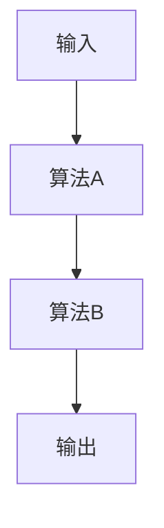
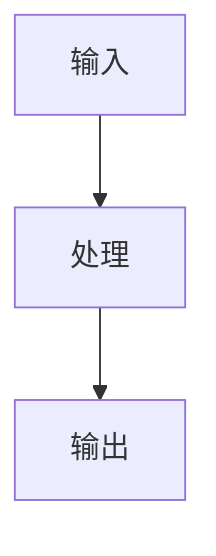
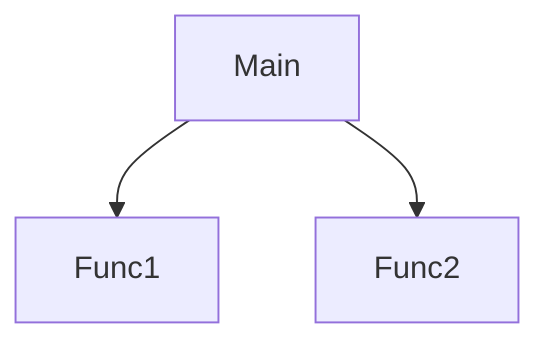

# LLM Wiki Agent — Schema & Workflow Instructions

## Output Language
`config.json` specifies `"output_language": "zh-CN"`. All wiki output must be written in Simplified Chinese.

This wiki is maintained entirely by your coding agent. No API key needed — just open this repo in Claude Code, OpenCode, or any agent that reads this file, and talk to it. For script-based ingest: use `--phase1/--phase2` workflow (agent spawns subagents for LLM calls).

## alphaXiv MCP

本项目通过 [alphaXiv MCP Server](https://www.alphaxiv.org/docs/mcp) 接入学术论文检索能力，作为 inbox 流程的补充。配置见 `docs/setup.md`。

可用工具：

| 工具 | 用途 | 在 wiki 中的应用 |
|------|------|------------------|
| `discover_papers` | 关键词+语义搜索论文 | 按主题发现相关文献 |
| `answer_pdf_queries` | 按问题提取论文特定页面 | 精准提取论文中的方法/数据 |
| `read_files_from_github_repository` | 读取论文关联的 GitHub 代码 | 代码走读流程的前置步骤 |
| `list_library` / `save_papers_to_folder` | 文献库管理 | 跟踪已读/待读论文 |

**注意：** alphaXiv MCP 工具在 agent 可用工具列表中显示为 `alphaxiv_*` 前缀。仅在 agent 已配置 MCP 时可用，非强制依赖。

### ⚠️ 论文全文获取方式

**不要使用 `get_paper_content` 获取全文。** 该工具返回的全文会被工具层 50KB 输出限制截断，导致内容不完整。

**正确流程（arXiv 论文）：**
1. **全文转换**：`arxiv2md <arxiv_id> -o output.md`（解析 arxiv HTML，保留公式/结构，图片以 URL 形式内嵌）
2. **精准查询**：用 `answer_pdf_queries` 针对具体问题提取论文特定页面

安装：`pip install git+https://github.com/timf34/arxiv2md.git`

示例：
```bash
# 转换论文为 markdown（含图片 URL）
arxiv2md 2512.14180 -o raw/inbox/2026-07-26/spherical-voronoi.md

# 精准查询（MCP 工具）
answer_pdf_queries paper="2512.14180" queries=["What are the main contributions?"]
```

## ⚠️ PDF Handling Rule
**NEVER use the Read tool on `.pdf` files.** Opencode's Read tool does not support PDFs — it will raise an error. Always run `python tools/pdf2md.py <file.pdf>` first, then use `ingest` on the generated `.md` file。

**注意：** arXiv 论文不要用 `pdf2md.py`，而是用 `arxiv2md`（解析 HTML，保留公式/结构更完整）。`pdf2md.py` 仅用于非 arXiv 的本地 PDF 文件。

## How to Use

Describe what you want in plain English or use shorthand triggers:

### Pipeline Triggers

| 触发词 | 动作 |
|---|---|
| `feeds` / `拉取 feeds` | 从配置的源拉取新内容到 inbox/ |
| `inbox` / `处理 inbox` | 解析 inbox.md 链接 → 生成 .md 到 inbox/ |
| `import bookmarks` / `导入书签` | 从 Edge 书签指定目录导入链接到 inbox.md |
| `dedup inbox` / `去重 inbox` | 按 arxiv ID 去重 inbox.md，关联 pdf/GitHub/项目页 |
| `archive bookmarks` / `归档书签` | 将 Edge Wiki/Inbox 书签移入 Wiki/Inbox Archive |
| `书签流程` / `bookmark pipeline` | 一条命令完成：导入 → 去重 → 归档 |
| `filter` / `开始筛选` | 筛选 inbox/ → 生成 digest/brief.md |
| `deep read` / `生成深度阅读` | 对 brief.md 中勾选的条目生成深度阅读 |
| `合入 wiki` / `ingest from digest` | 将 digest 中勾选条目合入 wiki |
| `ingest <file>` / `合入 <file>` | 直接合入单个文件到 wiki |
| `read paper <url>` / `阅读论文 <url>` / `深度阅读 <url>` | 直接阅读 arxiv/PDF/网页 → 生成深度阅读到 deepdive.md（arXiv 用 arxiv2md，PDF 用 pdf2md.py） |
| `read code` / `代码阅读` | 子代理驱动：收集代码 → 分析 → 生成 wiki 页面（见 Code Reading Workflow） |
| `search papers <query>` / `搜索论文` | 使用 alphaXiv MCP 搜索论文并添加到 inbox |
| `status` / `流程状态` | 检查各流程节点状态并建议下一步 |
| `fetch sources` / `抓取源文件` | 自动抓取 brief.md 中缺失/空的源文件 |

### Maintenance Triggers

| 触发词 | 动作 |
|---|---|
| `health` | 结构完整性检查（快速，无 LLM） |
| `lint` | 内容质量检查（慢，需要 LLM） |
| `build graph` | 构建知识图谱 |
| `heal` | 自动补全缺失的实体/概念页 |
| `refresh` | 重新 ingest 已变更的源文档 |

### Query Triggers

| 触发词 | 动作 |
|---|---|
| `query: <question>` | 基于 wiki 内容回答（`python tools/query.py`） |
| `read paper <arxiv_id>` | `arxiv2md <id> -o output.md` + LLM 深度阅读 |
| *plain question* | 描述需求，如 "ingest this file: raw/papers/...md" |

### Agent Proactive Reminders

The agent should proactively detect and remind with trigger words:
- **inbox.md has links**: "inbox.md 中有 N 个链接待处理（触发词: inbox）"
- **inbox/ has files**: "今日有 N 份文件待筛选（触发词: filter）"
- **Pending deep-read**: "brief.md 有 `[x] 深度阅读` 但未生成报告（触发词: deep read）"
- **Pending ingest**: "brief.md 有 `[x] 合入 wiki` 但未处理（触发词: ingest from digest）"
- **Feeds stale**: "feeds 已 N 天未拉取（触发词: feeds）"
- **After filter completes**: "筛选完成！请阅读 brief.md 确认"
- **Source files missing**: "brief.md 有 N 个源文件为空/缺失（触发词: fetch sources）"

### Status Auto-Detect

Run `python tools/status.py` — checks pipeline state and suggests next step.
`python tools/status.py --blockers` — show what blocks each step.
`python tools/status.py --next filter` — exit 0/1 if step can run.

## Status Flow

`待处理` → `已深度阅读` → `已合入/已跳过`

---

## Directory Layout

```
raw/          inbox/  inbox.md
              inbox/  YYYY-MM-DD/  *.md
               digest/  brief.md  YYYY-MM-DD/{deepdive-*/,}  sources/YYYY-MM-DD/  brief/
              filter/ papers/ articles/ talks/ books/ projects/ docs/ datasets/
              codes/  git clone 的代码仓库（按需创建）
wiki/         index.md log.md overview.md issues.md interests.md
              sources/ entities/ concepts/ syntheses/
graph/        graph.json graph.html
templates/    generic.md paper.md article.md book.md dataset.md doc.md project.md talk.md
tools/        inbox.py health.py lint.py build_graph.py filter.py deep-read.py
              download-images.py ingest.py status.py validate-wiki.py
              heal.py refresh.py query.py file_to_md.py pdf2md.py code-read.py
              fetch-sources.py
```

## Link Inbox → Filter → Deep Read → Ingest Workflow

This is the recommended workflow for processing new materials from inbox/ into wiki.

### Pre-step: Inbox Links

Triggered by: *"inbox"* or `python tools/inbox.py`

Steps:
1. Read `raw/inbox/inbox.md` — contains URL links (arXiv IDs, web pages)
2. For each arXiv link → use `arxiv2md` (or fallback to `pdf2md.py`) to convert to markdown
3. For each web URL → use `requests` + `trafilatura` to fetch page and extract readable markdown
4. Save each converted file to `raw/inbox/YYYY-MM-DD/<slug>.md`
5. Clear `inbox.md`

### Stage 1: Filter

Triggered by: *"filter"* or `python tools/filter.py`

Steps:
1. Scan `raw/inbox/` for files
2. Read `wiki/interests.md`（含 `## 兴趣列表` 和 `## 排除列表` 两个分区；排除列表按 `### 方向/细分领域/技术` 分层组织）
3. Use LLM to analyze each file:
   - Generate brief summary (3-5 sentences)
   - Generate detailed report (500-800 words in Chinese)
   - Match against interests: `interested` / `possibly_interested` / `not_interested`
   - Match against exclusion list: 命中则强制 `not_interested`
   - Suggest category (papers/articles/talks/books/docs/projects/datasets)
   - Optionally suggest new interests/disinterests via `suggested_new_interests` / `suggested_new_disinterests`
4. Generate `raw/digest/brief.md` with entries sorted by match level
   - Each entry includes: title, source URL, matched interests, brief (3-5 sentences), detailed report (500-800 words), checkboxes for [ ] 深度阅读、[ ] 合入 wiki、[ ] 不感兴趣
   - Entries grouped by match level: `[感兴趣]` → `[可能感兴趣]`（`[不感兴趣]` 不写入 brief）
5. Move processed files to `raw/digest/YYYY-MM-DD/sources/`
6. Archive current brief.md to `raw/digest/brief/YYYY-MM-DD.md`
7. Clear inbox/   → 用户阅读 `brief.md`，勾选 `[x] 深度阅读`、`[x] 合入 wiki` 或 `[x] 不感兴趣` 确定下一步
   - 控制台会汇总 LLM 建议的新增兴趣/排除项供参考

#### ⚠️ 兴趣匹配规则（保守原则）

- **只标记 `interested` 当文档核心主题与兴趣条目直接对应**。关键词只是辅助，不能仅凭关键词出现就判定感兴趣
- **`possibly_interested` 要求：** 文档至少 30% 内容与兴趣条目相关，而非仅提及
- **宁可漏判不可误判**：拿不准时标记 `not_interested`，让用户在 brief 中手动发现
- **不要发散猜测**：不要因为标题/摘要提到了兴趣领域的上位概念就标记感兴趣（如兴趣是"3D高斯泼溅"，不要因为文档提到"3D视觉"就标记）
- **匹配理由必须具体**：写明"文档的 XXX 部分直接讨论了 XXX 兴趣条目"，而非"文档涉及相关领域"

#### ⚠️ brief.md 源文件自动抓取

当 brief.md 中条目的源文件路径对应文件为空（0 字节）或不存在时，自动从 `source_url` 重新抓取内容：
- arxiv URL → `arxiv2md <arxiv_id> -o <path>`
- 网页 URL → `webfetch` + trafilatura 提取
- PDF → `python tools/pdf2md.py <url> -o <path>`
- 抓取后更新 brief.md 中对应条目的源文件路径

### Stage 2: Deep Read

Triggered by: *"generate deep-read"* or `python tools/deep-read.py --date YYYY-MM-DD`

Steps:
1. Read brief.md to find entries marked `[x] 深度阅读` and `[x] 不感兴趣`
2. For each `[x] 不感兴趣` entry, call LLM to generate interests.md update suggestions:
   - Suggest adding to 排除列表 or modifying existing interests
   - Save suggestions to `raw/digest/YYYY-MM-DD/disinterest-suggestions.md`
   - 控制台输出建议供参考
3. For each `[x] 深度阅读` entry, call LLM to generate 1500-3000 word deep-dive report:
   - Core viewpoints deep analysis
   - Technical/methodology breakdown
   - Key data/insights interpretation
   - Comparison with related fields
   - Potential issues/limitations
4. Save deep-dive reports to `raw/digest/YYYY-MM-DD/deepdive.md`

> **注意：** Stage 2 和 Stage 3 可独立触发。brief.md 中 `[x] 合入 wiki` 不需要先 `[x] 深度阅读`，可直接进入 Stage 3。

### Stage 2b: Direct Read (skip inbox)

Triggered by: *"read paper <url>"* or *"阅读论文 <url>"* or `python tools/deep-read.py --paper <url>`

跳过 inbox 流程，直接对单篇论文/网页生成深度阅读报告。

Steps:
1. 检测输入类型：
   - arxiv URL → 提取 arxiv_id，用 `arxiv2md <arxiv_id> -o output.md` 转换（解析 HTML，保留公式/结构，图片以 URL 内嵌）
   - PDF 路径 → 用 `python tools/pdf2md.py <path>` 转换为 markdown
   - 网页 URL → 用 `webfetch` 抓取 HTML，再用 trafilatura 提取正文
2. 提取标题（从 markdown 首个 `#` 行）
3. 调用 LLM 生成深度阅读报告（与 Stage 2 相同 prompt）
4. 追加到 `raw/digest/YYYY-MM-DD/deepdive.md`

用法：
```bash
python tools/deep-read.py --paper https://arxiv.org/abs/2401.12345
python tools/deep-read.py --paper /path/to/paper.pdf
python tools/deep-read.py --paper https://example.com/article
```

### Stage 3: Ingest to Wiki

Triggered by: *"ingest from digest"* or `python tools/ingest.py --from-digest YYYY-MM-DD`

可直接对 brief.md 中勾选了 `[x] 合入 wiki` 的条目执行，无需先深度阅读。

Steps:
1. Read brief.md to find entries marked `[x] 合入 wiki`
2. Find corresponding files in `digest/YYYY-MM-DD/sources/`
3. Show list to user for category confirmation
4. Move files to appropriate category directory (raw/{papers,articles,...}/)
5. Run ingest() for each file (follows existing Ingest Workflow)
6. Update brief.md status

#### ⚠️ 模板遵从规则

**Ingest 必须严格遵循 `templates/` 中对应类型的模板。** 模板定义了：
- Frontmatter 字段（title, type, tags, date, source_file, url, venue, published, links）
- 正文章节顺序和内容要求
- 图片引用格式：`` 或直接使用 arxiv URL

**Paper 模板特殊要求：**
- Method 章节最前面放框架图/流程图/管线图（用 arxiv HTML URL 链接，如 `https://arxiv.org/html/.../figures/images/...`）
- 包含 Related Work Analysis 章节
- Method 章节双重写作：整体思路（直白解释设计动机）+ 复现细节（公式、超参数）

---

## Page Format

**所有 wiki 页面必须遵循 `templates/` 目录中的对应模板。**

可用模板：`paper.md`、`article.md`、`book.md`、`dataset.md`、`doc.md`、`project.md`、`talk.md`、`generic.md`

### Paper 模板结构

```yaml
---
title: "Paper Title"
type: source
tags: [paper]
date: YYYY-MM-DD
source_file: raw/papers/...
url: ""
venue: ""
published: YYYY
links: []
---
```

```
## Summary
## 原始出处
## Key Contributions
## Method
  - 整体思路（直白语言解释设计动机）
  - 各组件/步骤（直觉 + 复现细节）
  - 框架图放在本节最前面
## Training
## Results & Comparisons
## Related Work Analysis
## Ablations
## Limitations
## Connections
## Contradictions
```

**Method 章节双重写作要求**：
1. **整体思路**：用直白语言解释"为什么这样做"和"每个步骤在干什么"
2. **复现细节**：给出可复现的技术细节（公式、超参数、数据流等）

Use `[[PageName]]` wikilinks to link to other wiki pages.

---

## Code Reading Workflow

Triggered by: *"read code"* or *"代码阅读"*

**核心原则**: 全流程由子代理完成，主 agent 仅负责 spawn，避免占用主 agent 上下文。

### 代码获取

当需要阅读的代码不在本地时：
1. Git 仓库 → `git clone <url> raw/codes/<project-name>`
2. 单个文件 → 直接读取或下载到 `raw/codes/`
3. 已在本地 → 直接使用

**仅在以下情况 clone**：
- 用户提问需要看代码才能解答
- 用户明确要求阅读某个代码仓库
- 不要无故 clone 不相关的代码

### 子代理工作流

1. **收集代码**: 运行 `python tools/code-read.py collect <path> [--url <git-url>]` 输出源码 JSON
2. **分析代码**: 子代理读取源码，用自身 LLM 能力生成结构化分析 JSON（含 title, slug, language, summary, framework_overview, algorithm_flow, step_breakdown, io_analysis, 3 张 Mermaid 图, dependencies, key_data_structures, design_patterns）
3. **写入 Wiki**: 运行 `python tools/code-read.py write --json-file <path>` 生成 wiki 页面 + 更新 index + log

### 主 agent 调用示例

```python
actor({
    "operation": "run",
    "subagent_type": "general",
    "description": "代码走读: <project-name>",
    "prompt": """分析代码并生成 wiki 页面。

步骤：
1. 运行 `python tools/code-read.py collect <path> [-o /tmp/code.json]` 收集代码
2. 读取源码，生成结构化分析 JSON（字段见下）
3. 将 JSON 写入 /tmp/analysis.json
4. 运行 `python tools/code-read.py write --json-file /tmp/analysis.json`

分析 JSON 必须包含：
- title: 简明标题
- slug: kebab-case 文件名
- language: 主要编程语言
- summary: 2-4 句概述
- framework_overview: 架构描述（300-500字），必须包含：
  - 设计意图表：解释每个关键设计决策的原因（如"为什么分离 pass"、"为什么用这种色彩空间"）
  - 源文件映射表：列出每个源文件的功能和所属模块
  - 数据流图：Mermaid graph LR 展示模块间的数据传递（含纹理格式）
- algorithm_flow: 核心算法流程（300-500字）
- step_breakdown: 步骤数组（step, name, input, process, output）
- io_analysis: 输入输出分析（200-400字）
- mermaid_architecture: Mermaid graph TD 架构图，要求：
  - 每个节点标注设计意图（如 `style` 高亮关键决策点）
  - 分支节点用 `{}` 表示条件选择
  - 注释说明每个模块的职责
  - 使用 stroke 边框高亮（不用 fill 填充，兼容深色主题）：`stroke:#888,stroke-width:2px`
- mermaid_flowchart: Mermaid flowchart TD 详细流程图（纵向，避免长横条），要求：
  - 使用 subgraph 分组相关步骤
  - 标注输入/输出数据格式
  - 关键步骤用 stroke 高亮（同上）
- mermaid_callgraph: Mermaid graph TD 调用图，要求：
  - 按模块分组（如 V1/V2，EASU/RCAS）
  - 标注函数的职责
  - 使用 stroke 区分模块
- flowchart_details: 每个 Mermaid 流程图后的详细说明（必须包含），要求：
  - 对每个模块/步骤说明：输入、处理、输出
  - 具体功能描述
  - 具体流程算法（如公式、计算步骤）
  - **每个输出必须说明效果和影响**：例如"局部对比度越大锐化权重越大"、"噪声因子越大锐化权重越小"
  - **详细输入输出效果说明**：对于每个算法步骤，必须说明：
    - 输入参数的含义和作用
    - 处理过程的数学原理
    - 输出结果的物理含义
    - 输出值大小对后续步骤的影响（如"contrast大→锐化权重增大"）
    - 不同取值范围的效果对比（如"std大→滤波器响应强，保留细节"、"std小→滤波器响应弱，平滑噪声"）
  - **必要时加入图示说明**：对于采样模式、数据布局、坐标系等复杂概念，使用 ASCII 图示或表格补充说明
  - **新出现的符号必须先定义**：使用前先说明符号含义
  - **避免内容重复**：同一算法的详细说明只保留一份，不要在多个章节重复
  - 使用中文撰写

### Wiki 页面结构规范

**避免重复的关键原则：**
- 算法详细说明只在一个地方完整展开
- 流程图章节只包含图表和简要引用
- 使用 `→ 详见 [章节名]` 引用其他章节的详细内容

**推荐的 wiki 页面结构：**
```
## Summary
## 原始出处
## 框架概览
  ### 架构设计意图
  ### 源文件映射
  ### 数据流
## 算法详解
  ### 整体架构图（Mermaid graph TD）
  ### 算法 A
    - 流程图（Mermaid flowchart TD）
    - 步骤 1: 输入处理
    - 步骤 2: 核心计算
    - ...
  ### 算法 B
    - 流程图（Mermaid flowchart TD）
    - 步骤 1: 输入处理
    - 步骤 2: 核心计算
    - ...
  ### 调用关系图（Mermaid graph TD）
## 依赖关系
## 关键数据结构
## 设计模式
## Connections
## Contradictions
```

**示例：架构图与算法详解合并**
```markdown
## 算法详解

### 整体架构图



### 算法 A



**步骤 1: 输入处理**
- 输入: ...
- 处理: ...
- 输出: ...
- **效果**: contrast大→锐化权重增大

### 算法 B


**步骤 1: 输入处理**
- 输入: ...
- 处理: ...
- 输出: ...

### 调用关系图


```
- dependencies: 外部依赖数组
- key_data_structures: 数据结构描述（100-300字）
- design_patterns: 设计模式描述（100-200字），必须解释每个模式的**优势**和**适用场景**
- source_path: 源码路径
- source_url: 仓库地址（可选）

使用中文撰写所有描述。Mermaid 节点用中文标注。"""
})
```

### inbox 中的代码走读

inbox.py 检测到 git URL 或本地路径时，输出 `[code] <link> — 待子代理处理`。主 agent 应 spawn 子代理处理：

1. 读 `raw/inbox/inbox.md` 找 type=git/local 的条目
2. 对每个条目 spawn 子代理执行上述工作流
3. 清理 inbox.md 中已处理的行

---

## Agent 编排：文件传输协议

**核心原则**: LLM 调用由子代理完成，中间结果通过文件传输，主 agent 不读大文件。

### 协议流程

```
脚本 --phase1 → 写 prompt 到 /tmp/wiki-tasks/
agent → spawn 子代理读 prompt，写结果到 /tmp/wiki-results/
脚本 --phase2 → 读结果，继续处理
```

### 支持的脚本

| 脚本 | Phase 1 | Phase 2 |
|------|---------|---------|
| `filter.py` | 生成分析 prompt | 解析结果写 brief.md |
| `deep-read.py` | 生成深度阅读 prompt | 解析结果写 deepdive.md |

### 主 agent 调用示例

```bash
# Filter: 分析 inbox 文件
python tools/filter.py --phase1
# agent spawn 子代理处理 /tmp/wiki-tasks/*.json
python tools/filter.py --phase2

# Deep Read: 生成深度阅读
python tools/deep-read.py --date 2024-01-15 --phase1
# agent spawn 子代理处理 /tmp/wiki-tasks/*.json
python tools/deep-read.py --date 2024-01-15 --phase2
```

### 子代理 prompt 模板

子代理读取 `/tmp/wiki-tasks/<id>.json`，执行 prompt，将结果写入 `/tmp/wiki-results/<id>.txt`：

```
读取 /tmp/wiki-tasks/<id>.json 中的 prompt
执行分析任务
将结果写入 /tmp/wiki-results/<id>.txt
```

### 优势

- Agent 上下文不膨胀：大文件内容不经过 agent
- 脚本保持数据处理逻辑：prompt 模板、解析、输出格式都在脚本里
- 子代理只做 LLM 推理：专注分析任务

---

## Ingest Workflow

Triggered by: *"ingest <file>"*

详细步骤见 [`docs/workflows/ingest.md`](docs/workflows/ingest.md)（含 Concept Distinction + Source-Type Templates）。

**Ingest 必须严格遵循 `templates/` 中对应类型的模板。**

---

## Query Workflow

Triggered by: *"query: <question>"*

Steps:
1. Read `wiki/index.md` to identify relevant pages
2. Read those pages
3. Synthesize an answer with inline citations as `[[PageName]]` wikilinks
4. Ask the user if they want the answer filed as `wiki/syntheses/<slug>.md`

---

## Lint Workflow

Triggered by: *"lint"*

详细步骤见 [`docs/workflows/lint.md`](docs/workflows/lint.md)（含 interests.md Format）。

**Lint 检查内容：**
1. 孤儿页面（没有其他页面链接的页面）
2. 断开的 wikilink（指向不存在页面的链接）
3. 缺失的实体页面（在 3+ 页面中提到但没有页面的实体）
4. 页面之间的矛盾（Contradictions）
5. 过时的内容（被更新源文档取代的摘要）
6. 数据缺口（wiki 无法回答的重要问题）
7. 缺乏深度的概念

**Connections 和 Contradictions 生成时机：**
- Connections：在 **ingest 阶段**生成，子代理分析代码时应识别与其他页面的关联
- Contradictions：在 **lint 阶段**生成，LLM 分析页面之间的矛盾和限制

**为什么 Contradictions 在 lint 阶段生成：**
- 需要语义分析（理解页面内容和关联）
- 需要跨页面比较（识别矛盾和限制）
- 需要 LLM 能力（理解上下文和推理）

**为什么 Connections 在 ingest 阶段生成：**
- 子代理分析代码时已了解代码功能
- 可以识别与其他已知页面的关联
- 不需要跨页面比较

## Health Workflow

Triggered by: *"health"* — `python tools/health.py` (zero LLM calls).

Checks (auto-fix, no confirmation needed):
- Empty/stub files (auto-delete)
- Index sync (auto-sync stale/missing entries)
- Log coverage (auto-append missing ingest entries)

Use `--save` for `wiki/health-report.md`.

| vs `lint` | `health` | `lint` |
|---|---|---|
| Scope | Structural | Content quality |
| LLM | Zero | Yes |
| Frequency | Every session | 10-15 ingests |
| Run order | First | After health passes

---

## Graph Workflow

Triggered by: *"build graph"* or *"graph report"*

详细步骤见 [`docs/workflows/graph.md`](docs/workflows/graph.md)。

---

## Naming Conventions

- Source slugs: `kebab-case` matching source filename
- Entity pages: `TitleCase.md` (e.g. `OpenAI.md`, `SamAltman.md`)
- Concept pages: `TitleCase.md` (e.g. `ReinforcementLearning.md`, `RAG.md`)

## Index & Log Format

Index: `## {Section}\n- [Title](path) — one-line`. See `wiki/index.md` for current structure.

Log: `## [YYYY-MM-DD] <operation> | <title>`. Operations: `ingest`, `query`, `health`, `lint`, `graph`, `report`.

> 日期使用操作执行日期（当前实际日期），而非源文档的原始发布日期。

---
## Reply Style
Respond in Chinese with minimal, technical text. No pleasantries, no openings, no summaries. Use newlines and short paragraphs for clarity. This rule applies to text responses only; code, comments, and commit messages remain as usual.
