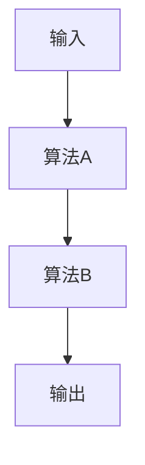
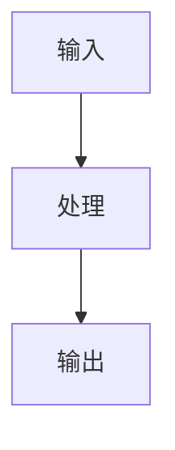

# Code Reading Workflow — 子代理 prompt 模板

> 从 AGENTS.md 外部化以节省 token。agent 在需要进行代码走读时带此文。

## 主 agent 调用示例

```python
actor({
    "operation": "run",
    "subagent_type": "general",
    "description": "代码走读: <project-name>",
    "prompt": """分析代码并生成 wiki 页面。

步骤：
1. 运行 `python tools/code-read.py collect <path> [-o /tmp/code.json]` 收集代码
2. 读取源码，生成结构化分析 JSON（字段见下）
3. 将 JSON 写入 /tmp/analysis.json
4. 运行 `python tools/code-read.py write --json-file /tmp/analysis.json`

分析 JSON 必须包含：
- title: 简明标题
- slug: kebab-case 文件名
- language: 主要编程语言
- summary: 2-4 句概述
- framework_overview: 架构描述（300-500字），必须包含：
  - 设计意图表：解释每个关键设计决策的原因
  - 源文件映射表：列出每个源文件的功能和所属模块
  - 数据流图：Mermaid graph LR 展示模块间的数据传递
- algorithm_flow: 核心算法流程（300-500字）
- step_breakdown: 步骤数组（step, name, input, process, output）
- io_analysis: 输入输出分析（200-400字）
- mermaid_architecture: Mermaid graph TD 架构图，要求：
  - 每个节点标注设计意图
  - 分支节点用 `{}` 表示条件选择
  - 注释说明每个模块的职责
  - 使用 stroke 边框高亮：`stroke:#888,stroke-width:2px`
- mermaid_flowchart: Mermaid flowchart TD 详细流程图（纵向），要求：
  - 使用 subgraph 分组相关步骤
  - 标注输入/输出数据格式
  - 关键步骤用 stroke 高亮
- mermaid_callgraph: Mermaid graph TD 调用图，要求：
  - 按模块分组
  - 标注函数的职责
  - 使用 stroke 区分模块
- flowchart_details: 每个 Mermaid 流程图后的详细说明（必须包含），要求：
  - 对每个模块/步骤说明：输入、处理、输出
  - 具体功能描述和流程算法
  - 每个输出必须说明效果和影响
  - 详细输入输出效果说明
  - 必要时加入 ASCII 图示或表格
  - 新出现的符号必须先定义
  - 避免内容重复
  - 使用中文撰写
- dependencies: 外部依赖数组
- key_data_structures: 数据结构描述（100-300字）
- design_patterns: 设计模式描述（100-200字），必须解释每个模式的**优势**和**适用场景**
- source_path: 源码路径
- source_url: 仓库地址（可选）

使用中文撰写所有描述。Mermaid 节点用中文标注。"""
})
```

## Wiki 页面结构规范

```
## Summary
## 原始出处
## 框架概览
  ### 架构设计意图
  ### 源文件映射
  ### 数据流
## 算法详解
  ### 整体架构图（Mermaid graph TD）
  ### 算法 A — 流程图 + 步骤 1/2/3
  ### 算法 B — 流程图 + 步骤 1/2/3
  ### 调用关系图
## 依赖关系
## 关键数据结构
## 设计模式
## Connections
## Contradictions
```

### 避免重复原则
- 算法详细说明只在一个地方完整展开
- 流程图章节只包含图表和简要引用
- 使用 `→ 详见 [章节名]` 引用其他章节的详细内容

### 架构图与算法详解合并示例
```markdown
## 算法详解

### 整体架构图


### 算法 A


**步骤 1: 输入处理**
- 输入: ...
- 处理: ...
- 输出: ...
- **效果**: contrast大→锐化权重增大
```
