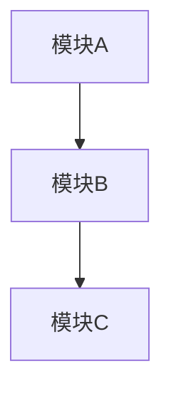
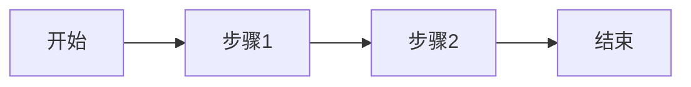
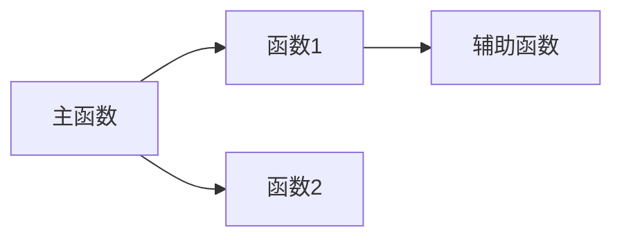

#### Code Template (`raw/codes/`)
```markdown
---
title: "代码标题"
type: source
tags: [code]
date: YYYY-MM-DD
source_file: path/to/file.py
language: python
---

## Summary
2-4 句概述代码功能、技术栈和核心用途。

## 原始出处
- 原始文件: [{source_file}]({source_file})

## 框架概览
代码的整体架构描述，包括模块划分、设计思路、主要组件及其关系。

## 核心算法流程
核心业务逻辑或算法的详细流程描述，用文字逐步说明。

## 步骤详解
逐步拆解关键函数/模块的执行流程，每个步骤包含输入、处理、输出。

**步骤 1: 名称**
- 输入: ...
- 处理: ...
- 输出: ...

## 输入输出分析
主要函数/接口的输入参数、返回值、数据格式和边界条件。

## 流程图

### 整体架构图


### 核心算法流程图


### 调用关系图


## 依赖关系
外部依赖库、内部模块依赖及版本要求。

## 关键数据结构
核心数据类、字典、配置等结构定义。

## 设计模式
使用的设计模式、架构风格及其选择原因。

## Connections
- [[EntityName]] — 关联说明
- [[ConceptName]] — 概念连接

## Contradictions
- 与 [[OtherPage]] 的矛盾点
```
