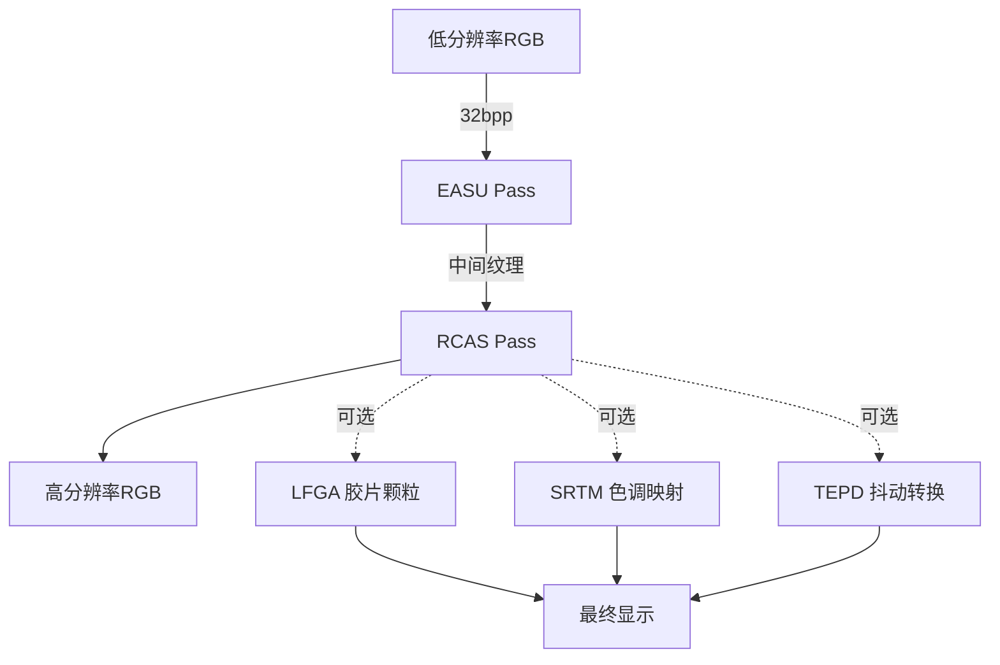
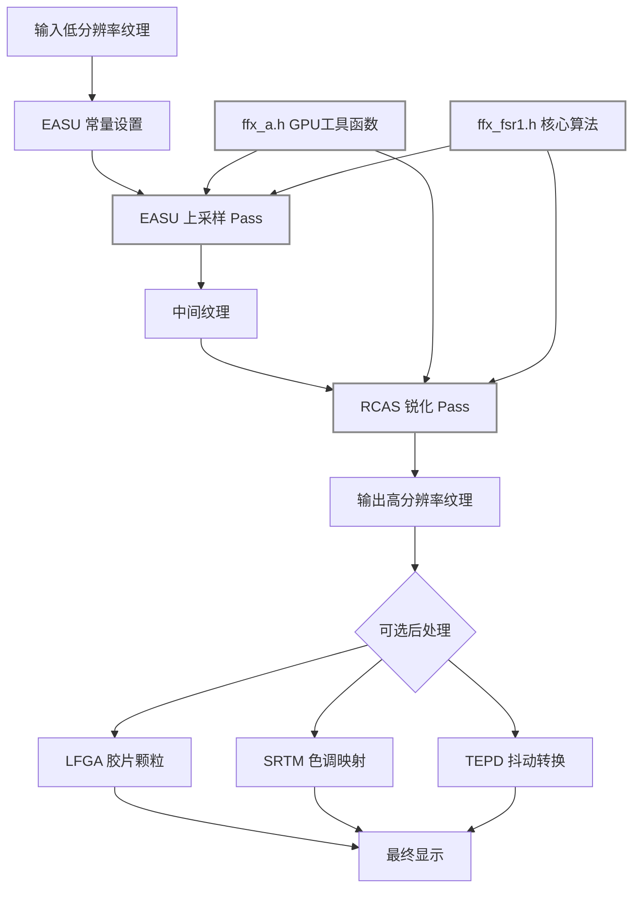
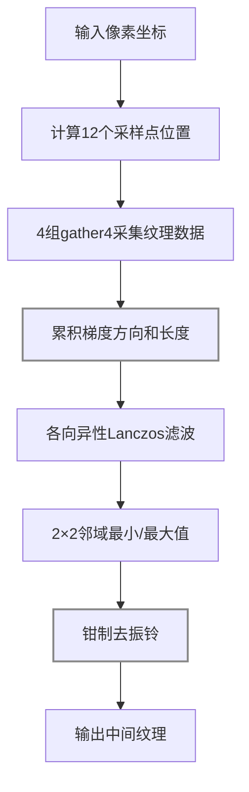
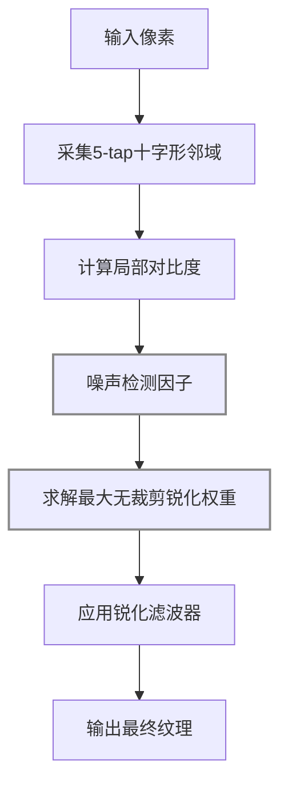
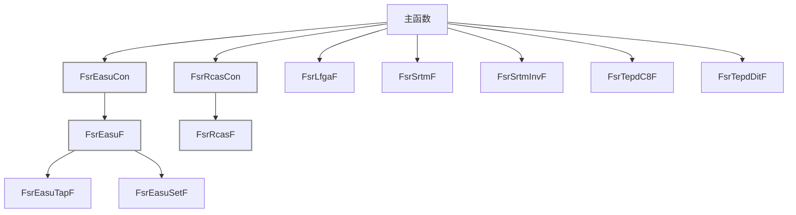

## Summary
AMD FidelityFX Super Resolution (FSR) 1.0 是一个开源的高质量空间超分辨率算法库。它通过自适应空间上采样（EASU）和对比度自适应锐化（RCAS）两个核心 Pass，将低分辨率输入图像放大到高分辨率输出，同时保持边缘清晰度。FSR 1.0 是纯空间算法，无需时序信息，适用于笔记本电脑和低端 GPU。

## 原始出处
- 原始文件: [D:\Code\SR\FidelityFX-FSR](D:\Code\SR\FidelityFX-FSR)
- 仓库地址: [https://github.com/GPUOpen-Effects/FidelityFX-FSR.git](https://github.com/GPUOpen-Effects/FidelityFX-FSR.git)

## 框架概览
FSR 1.0 采用 Header-only 架构设计，核心算法全部以 HLSL/GLSL 着色器代码实现在两个头文件中：`ffx_a.h`（跨平台 GPU 工具函数）和 `ffx_fsr1.h`（FSR 核心算法）。这种设计使得集成商只需包含头文件并实现回调函数即可将 FSR 嵌入任意渲染管线。代码支持三种精度变体：单精度浮点（*F）、半精度打包（*H）和双通道并行半精度（*Hx2），开发者可根据目标硬件选择最优路径。示例应用展示了 DX12 和 Vulkan 两种后端的完整集成流程，包含 EASU 上采样 Pass、RCAS 锐化 Pass 以及可选的色调映射、胶片颗粒和抖动转换工具函数。整个库不依赖任何外部图形 API 框架，仅通过预处理宏和回调函数实现平台抽象。

### 架构设计意图
| 设计决策 | 原因 |
|---|---|
| Header-only | 无需编译独立库，集成商只需 `#include` 即可，简化跨平台分发 |
| 回调函数模式 | 允许集成商自定义纹理采样逻辑，适配不同的渲染管线和资源管理方式 |
| EASU + RCAS 分离 | 上采样和锐化是独立操作，分离后可单独调整强度，也支持只用其中一个 |
| 三种精度变体 | 移动端用 float16 省带宽，桌面端用 float32 保质量，Hx2 双通道并行提升吞吐 |
| 2×2 邻域去振铃 | Lanczos 滤波器固有的振铃伪影，通过钳制到局部邻域范围消除 |
| 噪声感知锐化 | 高通滤波器检测噪声区域，抑制过度锐化，避免放大噪声 |

### 源文件映射
| 文件 | 功能 | 说明 |
|---|---|---|
| `ffx_a.h` | GPU 工具函数 | 平台抽象层，提供 AHalf/AFloat 类型和数学函数 |
| `ffx_fsr1.h` | FSR 核心算法 | EASU + RCAS 完整实现，所有精度变体 |
| `fsr1_api.h` | API 封装 | DX12/Vulkan 后端的资源创建和调度 |
| `fsr1_shaders.h` | 着色器定义 | Compute/Pixel Shader 入口点定义 |

### 数据流


**数据流图详细说明**

**模块 1: 低分辨率 RGB 输入**
- 输入: 游戏引擎渲染的低分辨率场景颜色
- 处理: 直接读取纹理，格式为 32bpp RGBA（每通道 8 位）
- 输出: 低分辨率 RGB 颜色数据

**模块 2: EASU Pass（边缘自适应空间上采样）**
- 输入: 低分辨率 RGB 纹理、常量缓冲区（包含像素转换参数）
- 处理: 
  1. 计算 12 个采样点位置
  2. 采集 4 组 gather4 纹理数据
  3. 累积梯度方向和长度
  4. 应用各向异性 Lanczos 滤波
  5. 用 2×2 邻域最小/最大值去振铃
- 输出: 上采样后的中间 RGB 纹理

**模块 3: RCAS Pass（鲁棒对比度自适应锐化）**
- 输入: EASU 输出的中间纹理、锐度参数
- 处理: 
  1. 采集 5-tap 十字形邻域
  2. 计算噪声检测因子
  3. 求解最大无裁剪锐化权重
  4. 应用锐化滤波器
- 输出: 锐化后的最终纹理

**模块 4: 可选后处理**
- LFGA 胶片颗粒: 添加胶片颗粒效果，保持时域能量守恒
- SRTM 色调映射: HDR 到 LDR 的可逆色调映射
- TEPD 抖动转换: 线性到 Gamma 2.0 的时域能量守恒抖动

**模块 5: 最终显示**
- 输入: RCAS 输出或后处理结果
- 处理: 直接显示
- 输出: 高分辨率 RGB 图像

---

## 算法详解

### 整体架构图



---

### EASU（Edge Adaptive Spatial Upsampling）



**步骤 1: 常量设置**
- 输入: 输入视口尺寸、输入图像尺寸、输出分辨率
- 处理: 
  1. 调用 FsrEasuCon() 计算 4 组常量（con0-con3）
  2. con0: 像素到归一化坐标的转换因子（1/inputWidth, 1/inputHeight）
  3. con1: gather4 采样偏移（左上、右上、左下、右下）
  4. con2: 输出分辨率缩放因子
  5. con3: 滤波器参数（锐度、方向权重）
- 输出: 4 个 uint4 常量，传递给 EASU 着色器

**步骤 2: 计算 12 个采样点位置**
- 输入: 输出像素坐标、常量缓冲区
- 处理: 
  1. 将输出坐标转换为输入坐标：inputPos = outputPos * con2.xy
  2. 通过 4 次 gather4 调用获取 12 个采样点（每次获取 2x2 块，其中 4 个为未使用的 z）
  3. 考虑边缘自适应：根据梯度方向调整滤波器形状
- 输出: 12 个采样点的 UV 坐标

**12-tap 采样模式图示（源码 ffx_fsr1.h）：**
```
      +---+---+
      |   |   |
      +--(0)--+
      | b | c |
  +---F---+---+---+
  | e | f | g | h |
  +--(1)--+--(2)--+
  | i | j | k | l |
  +---+---+---+---+
      | n | o |
      +--(3)--+
      |   |   |
      +---+---+
```

gather4 调用与采样点对应：
| gather4 调用 | 返回值 | 采样点 |
|---|---|---|
| FsrEasuRF/G/BF(p0) | bczz | b, c (z为未使用) |
| FsrEasuRF/G/BF(p1) | ijfe | i, j, f, e |
| FsrEasuRF/G/BF(p2) | klhg | k, l, h, g |
| FsrEasuRF/G/BF(p3) | zzon | o, n (z为未使用) |

采样点坐标偏移（以 g 为中心像素）：
| 位置 | 坐标偏移 | 说明 |
|------|----------|------|
| g | [0, 0] | 中心像素（输出位置） |
| f | [-1, 0] | 左方 1 像素 |
| e | [-2, 0] | 左方 2 像素 |
| h | [+1, 0] | 右方 1 像素 |
| b | [-1, +1] | 左上 |
| c | [0, +1] | 上方 |
| i | [-2, -1] | 左下偏左 |
| j | [-1, -1] | 左下 |
| k | [0, -1] | 下方 |
| l | [+1, -1] | 右下 |
| n | [0, -2] | 下方 2 像素 |
| o | [+1, -2] | 右下偏右 |

**注意**: 该模式不对称——左侧延伸到 x=-2（e, i），右侧仅到 x=+1（h, l）。这是因为边缘自适应需要沿梯度方向拉伸滤波器。

**步骤 3: 4 组 gather4 采集纹理数据**
- 输入: 低分辨率 RGB 纹理、采样点位置
- 处理: 
  1. 调用 4 次 gather4 指令，每次获取 2×2 像素块
  2. gather4(R): 获取红色通道的 2×2 块
  3. gather4(G): 获取绿色通道的 2×2 块
  4. gather4(B): 获取蓝色通道的 2×2 块
  5. gather4(A): 获取 Alpha 通道的 2×2 块（可选）
  6. 共获取 4×4 = 16 个采样值
- 输出: 4 组 gather4 结果（16 个采样值）

**步骤 4: 累积梯度方向和长度**
- 输入: 12 个采样点的亮度值（lA-lE）、像素位置小数部分（pp）
- 处理: 调用 4 次 FsrEasuSetF() 累积梯度信息

**FsrEasuSetF() 梯度计算详解（源码 ffx_fsr1.h:274-313）：**

```
输入采样点布局（十字形）：
    a
  b c d
    e
```

**1. 方向计算（dir）— 为什么是"方向"？**

方向是二维向量 (dir.x, dir.y)，表示**亮度变化的方向**：
- dir.x = lD - lB（右方像素 - 左方像素）
- dir.y = lE - lA（下方像素 - 上方像素）

**物理含义：**
```
如果 dir.x > 0：亮度从左到右增加（边缘在右侧）
如果 dir.x < 0：亮度从左到右减少（边缘在左侧）
如果 dir.y > 0：亮度从上到下增加（边缘在下方）
如果 dir.y < 0：亮度从上到下减少（边缘在上方）
```

**示例：**
```
亮度分布：     梯度方向：
  1 2 3          →
  4 5 6          →
  7 8 9          →

dir.x = 9 - 7 = 2（正数，向右）
dir.y = 9 - 1 = 8（正数，向下）
```

**2. 长度计算（len）— 梯度强度**

长度表示**边缘的强度**（对比度）：
```
dc = lD - lC          // 右侧差分
cb = lC - lB          // 左侧差分
lenX = max(abs(dc), abs(cb))  // 取最大差分
lenX = 1 / lenX               // 取倒数（小梯度→大值）
lenX = abs(dirX) * lenX       // 归一化
lenX = lenX * lenX            // 平方增强对比度
```

**物理含义：**
- lenX 大：边缘清晰（对比度高）
- lenX 小：边缘模糊（对比度低）

**3. 双线性插值权重（w）— 根据像素位置的小数部分计算权重**

**符号定义：**
- `ip`: 输出像素的整数坐标（如 (100, 200)）
- `pp`: 浮点像素位置（ip 经过缩放和偏移后的值）
- `fp`: pp 的整数部分（floor(pp)）
- `pp - fp`: pp 的小数部分（0.0 ~ 1.0，表示像素在网格中的精确位置）

**像素位置计算（源码 ffx_fsr1.h:324-326）：**
```
pp = ip * con0.xy + con0.zw  // 将整数像素坐标转换为浮点位置
fp = floor(pp)                // 取整数部分（像素索引）
pp = pp - fp                  // 得到小数部分（0.0 ~ 1.0）
```

**示例：**
```
假设 ip = (101, 201)
假设 con0.xy = (0.5, 0.5), con0.zw = (0.0, 0.0)

pp = (101, 201) * (0.5, 0.5) + (0.0, 0.0) = (50.5, 100.5)
fp = floor((50.5, 100.5)) = (50, 100)
pp - fp = (0.5, 0.5)  // 小数部分为 0.5，在 4 个像素中心
```

**像素网格示意：**
```
  (50,100)  (51,100)  (52,100)
    ●---------●---------●
    |         |         |
    |    ×    |         |  × = 当前像素位置 (50.5, 100.5)
    |         |         |
  (50,101)  (51,101)  (52,101)
    ●---------●---------●

pp.x = 0.5（在左边缘右侧 50%）
pp.y = 0.5（在上边缘下方 50%）
```

**双线性插值权重：**
```
左上：w = (1-0.5)*(1-0.5) = 0.25
右上：w = 0.5*(1-0.5) = 0.25
左下：w = (1-0.5)*0.5 = 0.25
右下：w = 0.5*0.5 = 0.25
总和：1.0
```

**用途：累积多个采样点的梯度信息**

在 FsrEasuSetF 中，4 次调用分别处理 4 个象限的采样点：
```
调用1 (biS=true):  处理左上象限的采样点，权重 w = (1-pp.x)*(1-pp.y)
调用2 (biT=true):  处理右上象限的采样点，权重 w = pp.x*(1-pp.y)
调用3 (biU=true):  处理左下象限的采样点，权重 w = (1-pp.x)*pp.y
调用4 (biV=true):  处理右下象限的采样点，权重 w = pp.x*pp.y
```

**累积公式：**
```
dir.x += dirX * w  // 方向累积
dir.y += dirY * w
len += lenX * w + lenY * w  // 长度累积
```

**物理含义：**
- 如果当前像素靠近某个采样点，该采样点的梯度贡献更大
- 如果当前像素在 4 个采样点中心，4 个采样点贡献相同
- 确保梯度信息在像素间平滑过渡，避免锯齿

**步骤 5: 各向异性 Lanczos 滤波**
- 输入: 12 个采样点颜色值、梯度方向（dir）、梯度长度（len）
- 处理: 调用 12 次 FsrEasuTapF() 进行加权累积

**FsrEasuTapF() 权重计算详解（源码 ffx_fsr1.h:239-272）：**

**符号定义：**
- `off`: 采样点相对于当前像素精确位置的偏移量
- `offX`: 偏移量的 x 分量
- `offY`: 偏移量的 y 分量
- `dir`: 梯度方向向量
- `len`: 梯度长度
- `lob`: 负瓣强度（negative lobe strength）
- `clp`: 距离裁剪点（clipping point）
- `c`: 采样点的颜色值

**偏移量计算（源码 ffx_fsr1.h:423-434）：**
```
FsrEasuTapF(aC, aW, AF2(0.0,-1.0)-pp, dir, len2, lob, clp, color); // 采样点 b
FsrEasuTapF(aC, aW, AF2(1.0,-1.0)-pp, dir, len2, lob, clp, color); // 采样点 c
FsrEasuTapF(aC, aW, AF2(-1.0,1.0)-pp, dir, len2, lob, clp, color); // 采样点 i
...
```

**偏移量的含义：**
```
采样点整数坐标 - 当前像素小数部分 = 偏移量

例如采样点 b：
整数坐标 = (0, -1)（相对于中心像素 f）
小数部分 pp = (0.3, 0.7)
偏移量 off = (0, -1) - (0.3, 0.7) = (-0.3, -1.7)
```

**1. 旋转偏移量到梯度坐标系**
```
v.x = off.x * dir.x + off.y * dir.y   // 沿梯度方向分量
v.y = off.x * (-dir.y) + off.y * dir.x // 垂直梯度方向分量
```

**物理含义：**
- v.x: 采样点在**梯度方向**上的投影距离
- v.y: 采样点在**垂直梯度方向**上的投影距离

**2. 各向异性缩放**
```
v *= len  // 根据梯度长度缩放
```

**作用：**
- 梯度强（边缘清晰）：v.y 被放大 → 垂直方向权重减小 → 保留边缘
- 梯度弱（边缘模糊）：v.y 被缩小 → 垂直方向权重增大 → 平滑噪声

**3. 计算距离平方**
```
d2 = v.x * v.x + v.y * v.y  // 旋转后的距离平方
d2 = min(d2, clp)           // 钳制到窗口范围
```

**4. 近似 Lanczos2 核函数**
```
// 公式：(25/16 * (2/5 * x^2 - 1)^2 - (25/16 - 1)) * (1/4 * x^2 - 1)^2
//        |_______________________________________|   |_______________|
//                       base                             window

wB = 2.0/5.0 * d2 - 1.0
wA = lob * d2 - 1.0
wB = wB * wB
wA = wA * wA
wB = 25.0/16.0 * wB - (25.0/16.0 - 1.0)
w = wB * wA  // 最终权重
```

**权重特性：**
- 中心像素（d2=0）：w ≈ 1.0
- 远离中心：w 快速衰减
- 负瓣（negative lobe）：w 可为负值（增强锐度）

**5. 加权累积**
```
aC += c * w  // 累积颜色
aW += w      // 累积权重
```

**6. 归一化**
```
pix = aC / aW  // 最终颜色 = 累积颜色 / 累积权重
```

**步骤 6: 2×2 邻域最小/最大值**
- 输入: 滤波结果、原始 2×2 邻域
- 处理: 
  1. 获取当前像素周围的 2×2 邻域颜色值
  2. 计算每个通道的最小值：minRGB = min(p00, p01, p10, p11)
  3. 计算每个通道的最大值：maxRGB = max(p00, p01, p10, p11)
  4. 扩展范围以允许轻微超调：minRGB *= 0.95, maxRGB *= 1.05
- 输出: 局部颜色范围（minRGB, maxRGB）

**步骤 7: 钳制去振铃**
- 输入: Lanczos 滤波结果、局部颜色范围
- 处理: 
  1. 钳制滤波结果到局部范围：result = clamp(lanczos, minRGB, maxRGB)
  2. 消除 Lanczos 滤波器固有的振铃伪影
  3. 确保输出颜色在合理范围内
- 输出: 去振铃后的中间纹理

---

### RCAS（Robust Contrast Adaptive Sharpening）



**步骤 1: 采集 5-tap 十字形邻域**
- 输入: EASU 输出的中间纹理、像素坐标
- 处理: 
  1. 采集 5 个采样点：
     - 中心像素：pCenter
     - 上方像素：pTop
     - 下方像素：pBottom
     - 左方像素：pLeft
     - 右方像素：pRight
  2. 使用 Sample 指令获取颜色值
- 输出: 5 个采样点颜色值

**步骤 2: 计算局部对比度**
- 输入: 5 个采样点颜色值
- 处理: 
  1. 计算 4 个邻域像素的均值：
     - mean4 = (pTop + pBottom + pLeft + pRight) / 4
  2. 计算中心像素与均值的差异：
     - diff = abs(pCenter - mean4)
  3. 计算局部对比度：
     - contrast = diff / (mean4 + epsilon)
  4. epsilon 是小常数（避免除零）
- 输出: 局部对比度值

**输出效果与影响：**
```
contrast 大（如 > 0.5）：
→ 中心像素与邻域差异大，存在明显边缘
→ 后续锐化权重会增大
→ 锐化效果更强

contrast 小（如 < 0.1）：
→ 中心像素与邻域差异小，处于平坦区域
→ 后续锐化权重会减小
→ 锐化效果较弱，避免引入噪声
```

**步骤 3: 噪声检测因子**
- 输入: 5 个采样点颜色值、局部对比度
- 处理: 
  1. 计算高频分量：
     - highFreq = abs(pCenter - pTop) + abs(pCenter - pBottom) + abs(pCenter - pLeft) + abs(pCenter - pRight)
  2. 计算低频分量：
     - lowFreq = abs(pTop - pBottom) + abs(pLeft - pRight)
  3. 计算噪声检测因子：
     - noiseFactor = highFreq / (lowFreq + epsilon)
  4. 噪声区域：noiseFactor > threshold
- 输出: 噪声检测因子（用于抑制过度锐化）

**输出效果与影响：**
```
noiseFactor 大（如 > 2.0）：
→ 高频分量多，可能是噪声
→ 后续锐化权重会被抑制
→ 锐化效果减弱，避免放大噪声

noiseFactor 小（如 < 0.5）：
→ 高频分量少，可能是真实边缘
→ 后续锐化权重保持
→ 锐化效果正常
```

**物理含义：**
```
高频分量 = 中心与4个邻域的差异总和
低频分量 = 上下差异 + 左右差异

如果中心是噪声：
- highFreq 大（中心与邻域差异大）
- lowFreq 小（邻域间差异小）
- noiseFactor 大

如果中心是边缘：
- highFreq 大（中心与邻域差异大）
- lowFreq 也大（邻域间差异也大）
- noiseFactor 中等
```

**步骤 4: 求解最大无裁剪锐化权重**
- 输入: 局部对比度、噪声检测因子
- 处理: 
  1. 根据对比度计算最大锐化权重：
     - maxWeight = contrast * sharpness
  2. 根据噪声检测因子调整权重：
     - finalWeight = maxWeight * (1.0 - noiseFactor)
  3. 钳制权重范围：
     - finalWeight = clamp(finalWeight, 0.0, maxAllowedWeight)
  4. maxAllowedWeight 是预定义上限（避免过度锐化）
- 输出: 最大无裁剪锐化权重

**输出效果与影响：**
```
finalWeight 大（如 > 0.5）：
→ 锐化滤波器中心权重更大
→ 边缘更锐利
→ 可能引入振铃伪影

finalWeight 小（如 < 0.1）：
→ 锐化滤波器接近单位矩阵
→ 锐化效果弱
→ 图像保持原始状态

finalWeight 为 0：
→ 完全不锐化
→ 输出等于输入
```

**权重计算公式：**
```
maxWeight = contrast * sharpness
finalWeight = maxWeight * (1.0 - noiseFactor)
finalWeight = clamp(finalWeight, 0.0, maxAllowedWeight)
```

**示例：**
```
假设 contrast = 0.6, sharpness = 2.0, noiseFactor = 0.3
maxWeight = 0.6 * 2.0 = 1.2
finalWeight = 1.2 * (1.0 - 0.3) = 0.84
finalWeight = clamp(0.84, 0.0, 1.0) = 0.84

→ 锐化权重较大，锐化效果明显
```

**步骤 5: 应用锐化滤波器**
- 输入: 5 个采样点颜色值、锐化权重
- 处理: 
  1. 计算锐化滤波器：
     - filter[0] = 1.0 + 4.0 * weight（中心）
     - filter[1..4] = -weight（上下左右）
  2. 应用滤波器：
     - result = pCenter * filter[0] + pTop * filter[1] + pBottom * filter[2] + pLeft * filter[3] + pRight * filter[4]
  3. 钳制输出范围：
     - result = clamp(result, 0.0, 1.0)
- 输出: 锐化后的最终颜色

**输出效果与影响：**
```
result = pCenter * (1 + 4*weight) - weight * (pTop + pBottom + pLeft + pRight)

weight 大：
→ 中心像素权重更大
→ 边缘更锐利
→ 可能引入振铃伪影

weight 小：
→ 滤波器接近 [1, 0, 0, 0, 0]
→ 输出接近输入
→ 锐化效果弱
```

**滤波器特性：**
```
weight = 0.0:  滤波器 = [1, 0, 0, 0, 0]（无锐化）
weight = 0.25: 滤波器 = [2, -0.25, -0.25, -0.25, -0.25]（轻度锐化）
weight = 0.5:  滤波器 = [3, -0.5, -0.5, -0.5, -0.5]（中度锐化）
weight = 1.0:  滤波器 = [5, -1, -1, -1, -1]（强锐化）
```

**可选后处理工具函数：**

**LFGA 胶片颗粒（源码 ffx_fsr1.h:1014）**
```c
void FsrLfgaF(inout AF3 c, AF3 t, AF1 a) {
    c += (t * AF3_(a)) * min(AF3_(1.0) - c, c);
}
```

**原理：**
- `c`: 输入颜色（线性色彩空间，0~1）
- `t`: 胶片颗粒纹理值（-0.5~0.5，支持彩色颗粒）
- `a`: 颗粒强度（0~1）

**算法：**
```
颗粒增量 = t * a * min(1.0 - c, c)
c = c + 颗粒增量
```

**作用：**
- 添加胶片颗粒效果，增加图像质感
- `min(1.0 - c, c)` 确保颗粒增量不会使颜色溢出（超出0-1范围）
- 时域能量守恒：颗粒纹理在时间上变化，但每像素的时域总和为零（无偏置）

**使用场景：**
- 电影感渲染
- 复古风格效果
- 避免色带（banding）伪影

**SRTM 色调映射（源码 ffx_fsr1.h:1043）**
```c
void FsrSrtmF(inout AF3 c) {
    c *= AF3_(ARcpF1(AMax3F1(c.r, c.g, c.b) + AF1_(1.0)));
}
```

**原理：**
- `c`: 输入颜色（线性 HDR，0~FP16_MAX）
- 输出: 临时 LDR 颜色（0~1）

**算法：**
```
maxChannel = max(c.r, c.g, c.b)
c = c / (maxChannel + 1.0)
```

**作用：**
- 将 HDR 颜色（0~FP16_MAX）转换为 LDR（0~1）
- 保持 RGB 比例（色相不变）
- 可逆：`FsrSrtmInvF` 可将 LDR 转回 HDR

**可逆性：**
```
正向：c = c / (max(c) + 1.0)
反向：c = c / (1.0 - max(c))
```

**使用场景：**
- HDR 渲染管线中需要临时转为 LDR 进行滤波
- 保持 HDR 颜色溢出（color bleed）效果

**TEPD 抖动转换（源码 ffx_fsr1.h:1099）**
```c
void FsrTepdC8F(inout AF3 c, AF1 dit) {
    AF3 n = sqrt(c);
    n = floor(n * AF3_(255.0)) * AF3_(1.0/255.0);
    AF3 a = n * n;
    AF3 b = n + AF3_(1.0/255.0); b = b * b;
    AF3 r = (c - b) * APrxMedRcpF3(a - b);
    c = ASatF3(n + AGtZeroF3(AF3_(dit) - r) * AF3_(1.0/255.0));
}
```

**原理：**
- `c`: 输入颜色（线性，0~1）
- `dit`: 抖动值（0~1，来自蓝噪声）

**算法：**
```
1. 转换到 Gamma 2.0 空间：n = sqrt(c)
2. 量化到 8-bit：n = floor(n * 255) / 255
3. 计算量化后的值：a = n², b = (n + 1/255)²
4. 计算插值比率：r = (c - b) / (a - b)
5. 根据抖动值选择：c = n + (dit > r ? 1/255 : 0)
```

**作用：**
- 将线性颜色转换为 Gamma 2.0 空间
- 使用抖动避免色带伪影
- 时域能量守恒：抖动在时间上平均后不改变图像色调

**使用场景：**
- 输出到 8-bit UNORM 纹理
- 避免线性到 Gamma 转换时的色带
- 保持时域稳定性

---

### 调用关系图



**EASU 调用链**
- 主函数 → FsrEasuCon: 计算 EASU 常量
  - 输入: 输入视口尺寸、输入图像尺寸、输出分辨率
  - 输出: 4 个 uint4 常量（con0-con3）
- 主函数 → FsrEasuF: EASU 核心函数
  - 输入: 低分辨率纹理、常量缓冲区
  - 处理: 执行完整的 EASU 算法
  - 输出: 上采样后的中间纹理
- FsrEasuF → FsrEasuTapF: 采集单个采样点
  - 输入: 纹理、采样点位置
  - 输出: 采样点颜色值
- FsrEasuF → FsrEasuSetF: 设置采样点数据
  - 输入: 采样点颜色值、梯度信息
  - 输出: 设置后的采样点数据

**RCAS 调用链**
- 主函数 → FsrRcasCon: 计算 RCAS 常量
  - 输入: 锐度参数
  - 输出: RCAS 常量
- 主函数 → FsrRcasF: RCAS 核心函数
  - 输入: EASU 输出纹理、锐度参数
  - 处理: 执行完整的 RCAS 算法
  - 输出: 锐化后的最终纹理

**可选后处理调用链**
- 主函数 → FsrLfgaF: 胶片颗粒应用
  - 输入: RCAS 输出、胶片颗粒纹理
  - 输出: 添加胶片颗粒后的纹理
- 主函数 → FsrSrtmF: 色调映射
  - 输入: HDR 颜色
  - 输出: LDR 颜色
- 主函数 → FsrSrtmInvF: 反向色调映射
  - 输入: LDR 颜色
  - 输出: HDR 颜色
- 主函数 → FsrTepdC8F: 抖动转换（C8 格式）
  - 输入: 线性颜色、抖动参数
  - 输出: Gamma 2.0 颜色
- 主函数 → FsrTepdDitF: 抖动转换（DIT 格式）
  - 输入: 线性颜色、抖动参数
  - 输出: Gamma 2.0 颜色

---

## 依赖关系
- 无外部图形 API 依赖
- 无第三方库依赖
- 示例应用依赖 Cauldron 框架（DX12/Vulkan）
- 示例应用依赖 CMake 3.16+ 构建系统
- 示例应用依赖 Visual Studio 2019
- 示例应用依赖 Windows 10 SDK 10.0.18362.0

## 关键数据结构
FSR 1.0 的核心数据结构是 4 组 uint4 常量（con0-con3），用于编码像素坐标转换、纹理采样偏移和滤波器参数。EASU 使用 12-tap 十字形采样模式（b,c,e,f,g,h,i,j,k,l,n,o），通过 gather4 操作高效采集 2×2 像素块。RCAS 使用 5-tap 十字形采样模式（b,d,e,f,h），支持 Alpha 通道直通。所有算法提供三种精度变体：float32（AF1/AF2/AF3/AF4）、float16（AH1/AH2/AH3/AH4）和打包 float16（AH2 双通道并行）。滤波器权重通过近似 Lanczos2 核函数计算，使用整数运算避免昂贵的三角函数和平方根。

## 设计模式
- **Header-only 设计模式**: 通过预处理宏（A_GPU、A_HLSL、A_GLSL、A_HALF）实现平台抽象，无需编译独立库
- **回调函数模式**: FsrEasuRF/GF/BF、FsrRcasLoadF 允许集成商自定义纹理采样逻辑，适配不同的渲染管线
- **常量预计算模式**: 将坐标转换和采样偏移预先计算并缓存，避免 GPU 上重复计算
- **多精度变体模式**: *F/*H/*Hx2 允许开发者根据目标硬件选择最优精度路径
- **噪声感知锐化模式**: 通过高通滤波器检测噪声区域并抑制过度锐化，避免放大噪声
- **时域能量守恒模式**: 确保胶片颗粒和抖动在时间平均后不改变图像色调

## Connections

- [[snapdragon-gsr]]: 高通 SGSR 也是超分辨率算法，但支持时间性融合
- [[DeepLearning]]: 现代超分辨率算法（如 DLSS、FSR 2.0）使用深度学习，FSR 1.0 是传统算法
- [[ComputerGraphics]]: FSR 是图形渲染管线中的后处理效果

## Contradictions

- FSR 1.0 是纯空间算法，不支持时间性融合，质量上限低于 FSR 2.0
- FSR 1.0 需要 LDR 输入（0~1），不支持 HDR 直接处理
- FSR 1.0 的锐化可能引入振铃伪影
