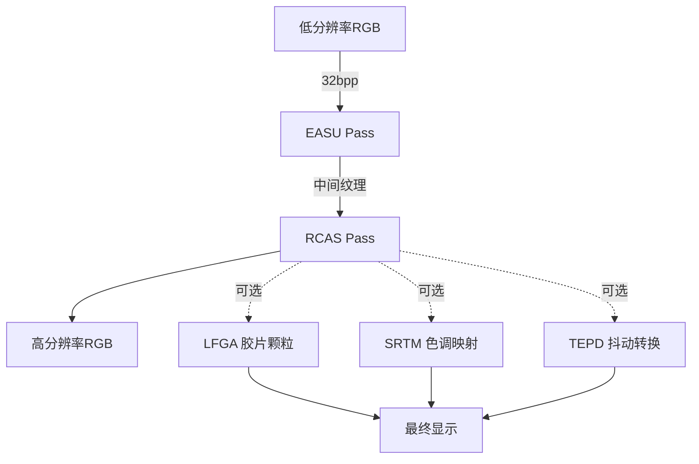
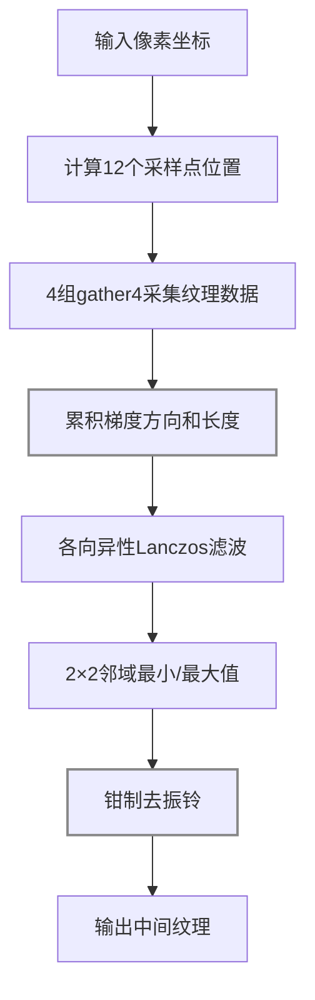
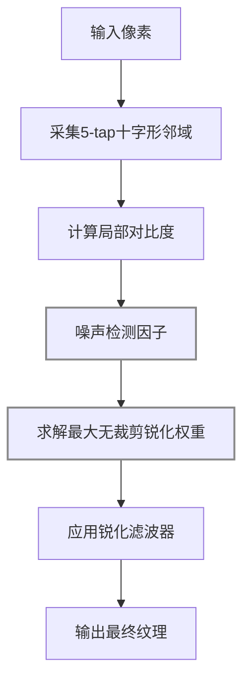
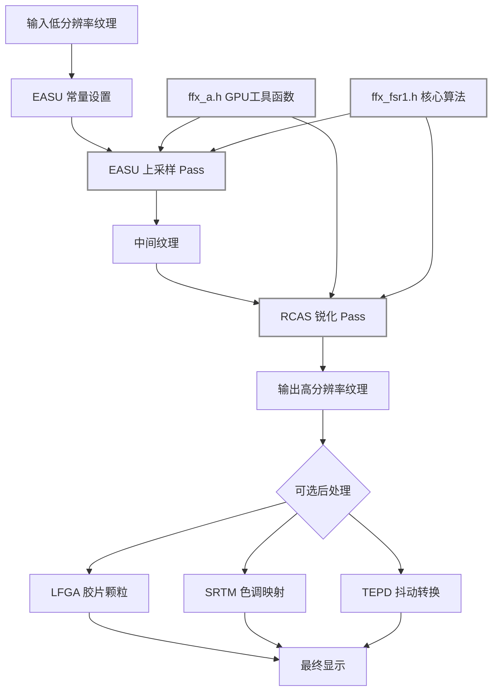
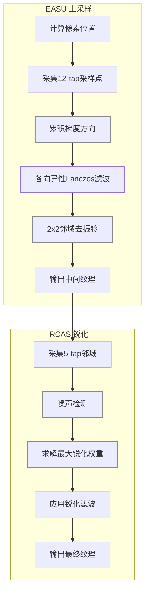
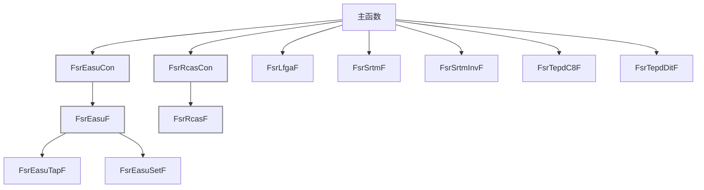

## Summary
AMD FidelityFX Super Resolution (FSR) 1.0 是一个开源的高质量空间超分辨率算法库。它通过自适应空间上采样（EASU）和对比度自适应锐化（RCAS）两个核心 Pass，将低分辨率输入图像放大到高分辨率输出，同时保持边缘清晰度。FSR 1.0 是纯空间算法，无需时序信息，适用于笔记本电脑和低端 GPU。

## 原始出处
- 原始文件: [D:\Code\SR\FidelityFX-FSR](D:\Code\SR\FidelityFX-FSR)
- 仓库地址: [https://github.com/GPUOpen-Effects/FidelityFX-FSR.git](https://github.com/GPUOpen-Effects/FidelityFX-FSR.git)

## 框架概览
FSR 1.0 采用 Header-only 架构设计，核心算法全部以 HLSL/GLSL 着色器代码实现在两个头文件中：`ffx_a.h`（跨平台 GPU 工具函数）和 `ffx_fsr1.h`（FSR 核心算法）。这种设计使得集成商只需包含头文件并实现回调函数即可将 FSR 嵌入任意渲染管线。代码支持三种精度变体：单精度浮点（*F）、半精度打包（*H）和双通道并行半精度（*Hx2），开发者可根据目标硬件选择最优路径。示例应用展示了 DX12 和 Vulkan 两种后端的完整集成流程，包含 EASU 上采样 Pass、RCAS 锐化 Pass 以及可选的色调映射、胶片颗粒和抖动转换工具函数。整个库不依赖任何外部图形 API 框架，仅通过预处理宏和回调函数实现平台抽象。

### 架构设计意图
| 设计决策 | 原因 |
|---|---|
| Header-only | 无需编译独立库，集成商只需 `#include` 即可，简化跨平台分发 |
| 回调函数模式 | 允许集成商自定义纹理采样逻辑，适配不同的渲染管线和资源管理方式 |
| EASU + RCAS 分离 | 上采样和锐化是独立操作，分离后可单独调整强度，也支持只用其中一个 |
| 三种精度变体 | 移动端用 float16 省带宽，桌面端用 float32 保质量，Hx2 双通道并行提升吞吐 |
| 2×2 邻域去振铃 | Lanczos 滤波器固有的振铃伪影，通过钳制到局部邻域范围消除 |
| 噪声感知锐化 | 高通滤波器检测噪声区域，抑制过度锐化，避免放大噪声 |

### 源文件映射
| 文件 | 功能 | 说明 |
|---|---|---|
| `ffx_a.h` | GPU 工具函数 | 平台抽象层，提供 AHalf/AFloat 类型和数学函数 |
| `ffx_fsr1.h` | FSR 核心算法 | EASU + RCAS 完整实现，所有精度变体 |
| `fsr1_api.h` | API 封装 | DX12/Vulkan 后端的资源创建和调度 |
| `fsr1_shaders.h` | 着色器定义 | Compute/Pixel Shader 入口点定义 |

### 数据流

#### 数据流图详细说明

**模块 1: 低分辨率 RGB 输入**
- 输入: 游戏引擎渲染的低分辨率场景颜色
- 处理: 直接读取纹理，格式为 32bpp RGBA（每通道 8 位）
- 输出: 低分辨率 RGB 颜色数据

**模块 2: EASU Pass（边缘自适应空间上采样）**
- 输入: 低分辨率 RGB 纹理、常量缓冲区（包含像素转换参数）
- 处理: 
  1. 计算 12 个采样点位置
  2. 采集 4 组 gather4 纹理数据
  3. 累积梯度方向和长度
  4. 应用各向异性 Lanczos 滤波
  5. 用 2×2 邻域最小/最大值去振铃
- 输出: 上采样后的中间 RGB 纹理

**模块 3: RCAS Pass（鲁棒对比度自适应锐化）**
- 输入: EASU 输出的中间纹理、锐度参数
- 处理: 
  1. 采集 5-tap 十字形邻域
  2. 计算噪声检测因子
  3. 求解最大无裁剪锐化权重
  4. 应用锐化滤波器
- 输出: 锐化后的最终纹理

**模块 4: 可选后处理**
- LFGA 胶片颗粒: 添加胶片颗粒效果，保持时域能量守恒
- SRTM 色调映射: HDR 到 LDR 的可逆色调映射
- TEPD 抖动转换: 线性到 Gamma 2.0 的时域能量守恒抖动

**模块 5: 最终显示**
- 输入: RCAS 输出或后处理结果
- 处理: 直接显示
- 输出: 高分辨率 RGB 图像

---

## 核心算法流程

### EASU（Edge Adaptive Spatial Upsampling）

#### EASU 算法详细说明

**步骤 1: 常量设置**
- 输入: 输入视口尺寸、输入图像尺寸、输出分辨率
- 处理: 
  1. 调用 FsrEasuCon() 计算 4 组常量（con0-con3）
  2. con0: 像素到归一化坐标的转换因子（1/inputWidth, 1/inputHeight）
  3. con1: gather4 采样偏移（左上、右上、左下、右下）
  4. con2: 输出分辨率缩放因子
  5. con3: 滤波器参数（锐度、方向权重）
- 输出: 4 个 uint4 常量，传递给 EASU 着色器

**步骤 2: 计算 12 个采样点位置**
- 输入: 输出像素坐标、常量缓冲区
- 处理: 
  1. 将输出坐标转换为输入坐标：inputPos = outputPos * con2.xy
  2. 计算 12 个采样点的相对偏移：
     - 水平方向：左右各 2 个像素（共 5 个）
     - 垂直方向：上下各 2 个像素（共 5 个）
     - 对角：4 个对角像素
  3. 考虑边缘自适应：根据梯度方向调整采样点位置
- 输出: 12 个采样点的 UV 坐标

**步骤 3: 4 组 gather4 采集纹理数据**
- 输入: 低分辨率 RGB 纹理、采样点位置
- 处理: 
  1. 调用 4 次 gather4 指令，每次获取 2×2 像素块
  2. gather4(R): 获取红色通道的 2×2 块
  3. gather4(G): 获取绿色通道的 2×2 块
  4. gather4(B): 获取蓝色通道的 2×2 块
  5. gather4(A): 获取 Alpha 通道的 2×2 块（可选）
  6. 共获取 4×4 = 16 个采样值
- 输出: 4 组 gather4 结果（16 个采样值）

**步骤 4: 累积梯度方向和长度**
- 输入: 16 个采样值
- 处理: 
  1. 计算水平梯度：gradX = (p[1,0] - p[0,0]) + (p[1,1] - p[0,1]) + (p[1,2] - p[0,2])
  2. 计算垂直梯度：gradY = (p[0,1] - p[0,0]) + (p[1,1] - p[1,0]) + (p[2,1] - p[2,0])
  3. 计算梯度长度：length = sqrt(gradX^2 + gradY^2)
  4. 计算梯度方向：angle = atan2(gradY, gradX)
  5. 累积所有采样点的梯度信息
- 输出: 梯度方向、梯度长度、局部对比度

**步骤 5: 各向异性 Lanczos 滤波**
- 输入: 12 个采样点颜色值、梯度信息
- 处理: 
  1. 根据梯度方向调整滤波器形状：
     - 沿梯度方向：使用较宽的滤波器（保留细节）
     - 垂直梯度方向：使用较窄的滤波器（平滑噪声）
  2. 应用 Lanczos2 核函数计算权重：
     - weight = fastLanczos2(distance)
     - 根据梯度长度调整权重：finalWeight = weight * (1.0 + gradientLength)
  3. 加权求和：result = sum(finalWeight * color) / sum(finalWeight)
- 输出: 各向异性 Lanczos 滤波结果

**步骤 6: 2×2 邻域最小/最大值**
- 输入: 滤波结果、原始 2×2 邻域
- 处理: 
  1. 获取当前像素周围的 2×2 邻域颜色值
  2. 计算每个通道的最小值：minRGB = min(p00, p01, p10, p11)
  3. 计算每个通道的最大值：maxRGB = max(p00, p01, p10, p11)
  4. 扩展范围以允许轻微超调：minRGB *= 0.95, maxRGB *= 1.05
- 输出: 局部颜色范围（minRGB, maxRGB）

**步骤 7: 钳制去振铃**
- 输入: Lanczos 滤波结果、局部颜色范围
- 处理: 
  1. 钳制滤波结果到局部范围：result = clamp(lanczos, minRGB, maxRGB)
  2. 消除 Lanczos 滤波器固有的振铃伪影
  3. 确保输出颜色在合理范围内
- 输出: 去振铃后的中间纹理

---

### RCAS（Robust Contrast Adaptive Sharpening）

#### RCAS 算法详细说明

**步骤 1: 采集 5-tap 十字形邻域**
- 输入: EASU 输出的中间纹理、像素坐标
- 处理: 
  1. 采集 5 个采样点：
     - 中心像素：pCenter
     - 上方像素：pTop
     - 下方像素：pBottom
     - 左方像素：pLeft
     - 右方像素：pRight
  2. 使用 Sample 指令获取颜色值
- 输出: 5 个采样点颜色值

**步骤 2: 计算局部对比度**
- 输入: 5 个采样点颜色值
- 处理: 
  1. 计算 4 个邻域像素的均值：
     - mean4 = (pTop + pBottom + pLeft + pRight) / 4
  2. 计算中心像素与均值的差异：
     - diff = abs(pCenter - mean4)
  3. 计算局部对比度：
     - contrast = diff / (mean4 + epsilon)
  4. epsilon 是小常数（避免除零）
- 输出: 局部对比度值

**步骤 3: 噪声检测因子**
- 输入: 5 个采样点颜色值、局部对比度
- 处理: 
  1. 计算高频分量：
     - highFreq = abs(pCenter - pTop) + abs(pCenter - pBottom) + abs(pCenter - pLeft) + abs(pCenter - pRight)
  2. 计算低频分量：
     - lowFreq = abs(pTop - pBottom) + abs(pLeft - pRight)
  3. 计算噪声检测因子：
     - noiseFactor = highFreq / (lowFreq + epsilon)
  4. 噪声区域：noiseFactor > threshold
- 输出: 噪声检测因子（用于抑制过度锐化）

**步骤 4: 求解最大无裁剪锐化权重**
- 输入: 局部对比度、噪声检测因子
- 处理: 
  1. 根据对比度计算最大锐化权重：
     - maxWeight = contrast * sharpness
  2. 根据噪声检测因子调整权重：
     - finalWeight = maxWeight * (1.0 - noiseFactor)
  3. 钳制权重范围：
     - finalWeight = clamp(finalWeight, 0.0, maxAllowedWeight)
  4. maxAllowedWeight 是预定义上限（避免过度锐化）
- 输出: 最大无裁剪锐化权重

**步骤 5: 应用锐化滤波器**
- 输入: 5 个采样点颜色值、锐化权重
- 处理: 
  1. 计算锐化滤波器：
     - filter[0] = 1.0 + 4.0 * weight（中心）
     - filter[1..4] = -weight（上下左右）
  2. 应用滤波器：
     - result = pCenter * filter[0] + pTop * filter[1] + pBottom * filter[2] + pLeft * filter[3] + pRight * filter[4]
  3. 钳制输出范围：
     - result = clamp(result, 0.0, 1.0)
- 输出: 锐化后的最终颜色

---

## 流程图

### 整体架构图

#### 整体架构详细说明

**EASU 常量设置模块**
- 输入: 输入视口尺寸、输入图像尺寸、输出分辨率
- 处理: 调用 FsrEasuCon() 计算 4 组常量（con0-con3）
- 输出: 4 个 uint4 常量，传递给 EASU 着色器

**EASU 上采样 Pass 模块**
- 输入: 低分辨率 RGB 纹理、常量缓冲区
- 处理: 
  1. 计算 12 个采样点位置
  2. 采集 4 组 gather4 纹理数据
  3. 累积梯度方向和长度
  4. 应用各向异性 Lanczos 滤波
  5. 用 2×2 邻域最小/最大值去振铃
- 输出: 上采样后的中间 RGB 纹理

**RCAS 锐化 Pass 模块**
- 输入: EASU 输出的中间纹理、锐度参数
- 处理: 
  1. 采集 5-tap 十字形邻域
  2. 计算噪声检测因子
  3. 求解最大无裁剪锐化权重
  4. 应用锐化滤波器
- 输出: 锐化后的最终纹理

**可选后处理模块**
- LFGA 胶片颗粒: 添加胶片颗粒效果，保持时域能量守恒
- SRTM 色调映射: HDR 到 LDR 的可逆色调映射
- TEPD 抖动转换: 线性到 Gamma 2.0 的时域能量守恒抖动

**GPU 工具函数模块（ffx_a.h）**
- 功能: 提供跨平台 GPU 工具函数
- 包含: AHalf/AFloat 类型定义、数学函数、纹理采样封装
- 作用: 支持 EASU 和 RCAS 的核心算法

**核心算法模块（ffx_fsr1.h）**
- 功能: FSR 核心算法完整实现
- 包含: EASU + RCAS 所有精度变体（*F/*H/*Hx2）
- 作用: 提供高质量空间超分辨率算法

---

### EASU + RCAS 详细流程

#### EASU + RCAS 流程详细说明

**EASU 子流程**

**A1: 计算像素位置**
- 输入: 输出像素坐标、常量缓冲区
- 处理: 将输出坐标转换为输入坐标：inputPos = outputPos * con2.xy
- 输出: 输入像素位置

**A2: 采集 12-tap 采样点**
- 输入: 输入像素位置、常量缓冲区
- 处理: 
  1. 计算 12 个采样点的相对偏移：
     - 水平方向：左右各 2 个像素（共 5 个）
     - 垂直方向：上下各 2 个像素（共 5 个）
     - 对角：4 个对角像素
  2. 考虑边缘自适应：根据梯度方向调整采样点位置
- 输出: 12 个采样点的 UV 坐标

**A3: 累积梯度方向**
- 输入: 16 个采样值（4 组 gather4）
- 处理: 
  1. 计算水平梯度：gradX = (p[1,0] - p[0,0]) + (p[1,1] - p[0,1]) + (p[1,2] - p[0,2])
  2. 计算垂直梯度：gradY = (p[0,1] - p[0,0]) + (p[1,1] - p[1,0]) + (p[2,1] - p[2,0])
  3. 计算梯度长度：length = sqrt(gradX^2 + gradY^2)
  4. 计算梯度方向：angle = atan2(gradY, gradX)
- 输出: 梯度方向、梯度长度、局部对比度

**A4: 各向异性 Lanczos 滤波**
- 输入: 12 个采样点颜色值、梯度信息
- 处理: 
  1. 根据梯度方向调整滤波器形状：
     - 沿梯度方向：使用较宽的滤波器（保留细节）
     - 垂直梯度方向：使用较窄的滤波器（平滑噪声）
  2. 应用 Lanczos2 核函数计算权重：
     - weight = fastLanczos2(distance)
     - 根据梯度长度调整权重：finalWeight = weight * (1.0 + gradientLength)
  3. 加权求和：result = sum(finalWeight * color) / sum(finalWeight)
- 输出: 各向异性 Lanczos 滤波结果

**A5: 2x2 邻域去振铃**
- 输入: Lanczos 滤波结果、原始 2×2 邻域
- 处理: 
  1. 获取当前像素周围的 2×2 邻域颜色值
  2. 计算每个通道的最小值：minRGB = min(p00, p01, p10, p11)
  3. 计算每个通道的最大值：maxRGB = max(p00, p01, p10, p11)
  4. 扩展范围以允许轻微超调：minRGB *= 0.95, maxRGB *= 1.05
- 输出: 局部颜色范围（minRGB, maxRGB）

**A6: 输出中间纹理**
- 输入: 去振铃后的滤波结果
- 处理: 直接输出
- 输出: 上采样后的中间 RGB 纹理

**RCAS 子流程**

**B1: 采集 5-tap 邻域**
- 输入: EASU 输出的中间纹理、像素坐标
- 处理: 
  1. 采集 5 个采样点：
     - 中心像素：pCenter
     - 上方像素：pTop
     - 下方像素：pBottom
     - 左方像素：pLeft
     - 右方像素：pRight
  2. 使用 Sample 指令获取颜色值
- 输出: 5 个采样点颜色值

**B2: 噪声检测**
- 输入: 5 个采样点颜色值
- 处理: 
  1. 计算高频分量：
     - highFreq = abs(pCenter - pTop) + abs(pCenter - pBottom) + abs(pCenter - pLeft) + abs(pCenter - pRight)
  2. 计算低频分量：
     - lowFreq = abs(pTop - pBottom) + abs(pLeft - pRight)
  3. 计算噪声检测因子：
     - noiseFactor = highFreq / (lowFreq + epsilon)
  4. 噪声区域：noiseFactor > threshold
- 输出: 噪声检测因子（用于抑制过度锐化）

**B3: 求解最大锐化权重**
- 输入: 局部对比度、噪声检测因子
- 处理: 
  1. 根据对比度计算最大锐化权重：
     - maxWeight = contrast * sharpness
  2. 根据噪声检测因子调整权重：
     - finalWeight = maxWeight * (1.0 - noiseFactor)
  3. 钳制权重范围：
     - finalWeight = clamp(finalWeight, 0.0, maxAllowedWeight)
- 输出: 最大无裁剪锐化权重

**B4: 应用锐化滤波**
- 输入: 5 个采样点颜色值、锐化权重
- 处理: 
  1. 计算锐化滤波器：
     - filter[0] = 1.0 + 4.0 * weight（中心）
     - filter[1..4] = -weight（上下左右）
  2. 应用滤波器：
     - result = pCenter * filter[0] + pTop * filter[1] + pBottom * filter[2] + pLeft * filter[3] + pRight * filter[4]
  3. 钳制输出范围：
     - result = clamp(result, 0.0, 1.0)
- 输出: 锐化后的最终颜色

**B5: 输出最终纹理**
- 输入: 锐化后的颜色
- 处理: 直接输出
- 输出: 最终高分辨率纹理

---

### 调用关系图

#### 调用关系详细说明

**EASU 调用链**
- 主函数 → FsrEasuCon: 计算 EASU 常量
  - 输入: 输入视口尺寸、输入图像尺寸、输出分辨率
  - 输出: 4 个 uint4 常量（con0-con3）
- 主函数 → FsrEasuF: EASU 核心函数
  - 输入: 低分辨率纹理、常量缓冲区
  - 处理: 执行完整的 EASU 算法
  - 输出: 上采样后的中间纹理
- FsrEasuF → FsrEasuTapF: 采集单个采样点
  - 输入: 纹理、采样点位置
  - 输出: 采样点颜色值
- FsrEasuF → FsrEasuSetF: 设置采样点数据
  - 输入: 采样点颜色值、梯度信息
  - 输出: 设置后的采样点数据

**RCAS 调用链**
- 主函数 → FsrRcasCon: 计算 RCAS 常量
  - 输入: 锐度参数
  - 输出: RCAS 常量
- 主函数 → FsrRcasF: RCAS 核心函数
  - 输入: EASU 输出纹理、锐度参数
  - 处理: 执行完整的 RCAS 算法
  - 输出: 锐化后的最终纹理

**可选后处理调用链**
- 主函数 → FsrLfgaF: 胶片颗粒应用
  - 输入: RCAS 输出、胶片颗粒纹理
  - 输出: 添加胶片颗粒后的纹理
- 主函数 → FsrSrtmF: 色调映射
  - 输入: HDR 颜色
  - 输出: LDR 颜色
- 主函数 → FsrSrtmInvF: 反向色调映射
  - 输入: LDR 颜色
  - 输出: HDR 颜色
- 主函数 → FsrTepdC8F: 抖动转换（C8 格式）
  - 输入: 线性颜色、抖动参数
  - 输出: Gamma 2.0 颜色
- 主函数 → FsrTepdDitF: 抖动转换（DIT 格式）
  - 输入: 线性颜色、抖动参数
  - 输出: Gamma 2.0 颜色

---

## 依赖关系
- 无外部图形 API 依赖
- 无第三方库依赖
- 示例应用依赖 Cauldron 框架（DX12/Vulkan）
- 示例应用依赖 CMake 3.16+ 构建系统
- 示例应用依赖 Visual Studio 2019
- 示例应用依赖 Windows 10 SDK 10.0.18362.0

## 关键数据结构
FSR 1.0 的核心数据结构是 4 组 uint4 常量（con0-con3），用于编码像素坐标转换、纹理采样偏移和滤波器参数。EASU 使用 12-tap 十字形采样模式（b,c,e,f,g,h,i,j,k,l,n,o），通过 gather4 操作高效采集 2×2 像素块。RCAS 使用 5-tap 十字形采样模式（b,d,e,f,h），支持 Alpha 通道直通。所有算法提供三种精度变体：float32（AF1/AF2/AF3/AF4）、float16（AH1/AH2/AH3/AH4）和打包 float16（AH2 双通道并行）。滤波器权重通过近似 Lanczos2 核函数计算，使用整数运算避免昂贵的三角函数和平方根。

## 设计模式
- **Header-only 设计模式**: 通过预处理宏（A_GPU、A_HLSL、A_GLSL、A_HALF）实现平台抽象，无需编译独立库
- **回调函数模式**: FsrEasuRF/GF/BF、FsrRcasLoadF 允许集成商自定义纹理采样逻辑，适配不同的渲染管线
- **常量预计算模式**: 将坐标转换和采样偏移预先计算并缓存，避免 GPU 上重复计算
- **多精度变体模式**: *F/*H/*Hx2 允许开发者根据目标硬件选择最优精度路径
- **噪声感知锐化模式**: 通过高通滤波器检测噪声区域并抑制过度锐化，避免放大噪声
- **时域能量守恒模式**: 确保胶片颗粒和抖动在时间平均后不改变图像色调

## Connections

## Contradictions
