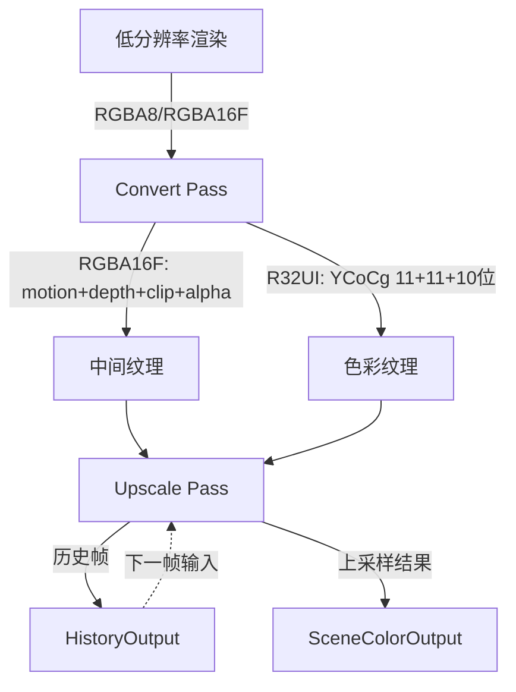
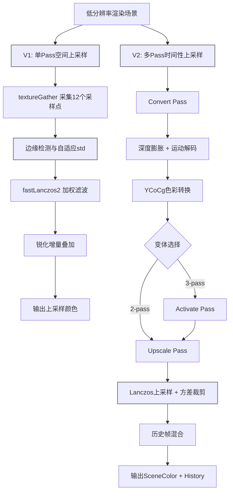
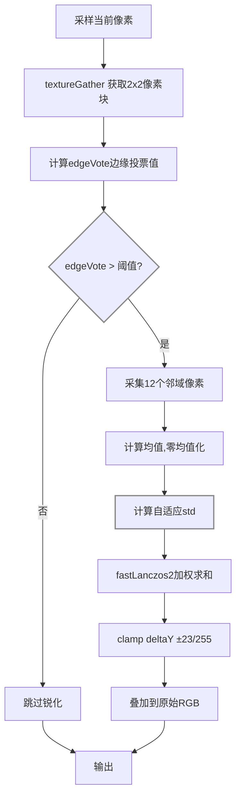
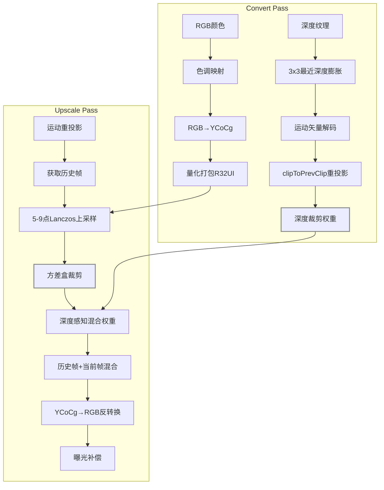
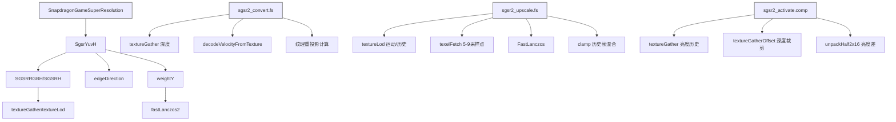

## Summary
Snapdragon Game Super Resolution (SGSR) 是高通为 Adreno GPU 设计的超级分辨率着色器库，包含两个版本：V1 是单 pass 空间上采样器，使用 12-tap Lanczos 滤波器和自适应锐化；V2 是时间性上采样器，通过运动矢量和历史帧融合实现更高质量的上采样，支持 2-pass-fs、2-pass-cs 和 3-pass-cs 三种变体。

## 原始出处
- 原始文件: [d:\Code\SR\snapdragon-gsr](d:\Code\SR\snapdragon-gsr)
- 仓库地址: [https://github.com/SnapdragonGameStudios/snapdragon-gsr.git](https://github.com/SnapdragonGameStudios/snapdragon-gsr.git)

## 框架概览
SGSR 是纯 GPU 着色器实现的超分辨率方案，专为 Adreno GPU 的 tiled 架构优化。项目结构分为 v1 和 v2 两个主版本。

### 架构设计意图
| 设计决策 | 原因 |
|---|---|
| V1 单 Pass | Adreno GPU 的 fragment shader 带宽有限，单次采样完成所有计算可最大化纹理缓存命中率 |
| V2 多 Pass 分离 | 时间性算法需要历史帧数据，分离 pass 可复用中间结果，避免重复计算 |
| YCoCg 色彩空间 | 人眼对亮度（Y）更敏感，分离后可对 Y 通道使用更高精度，Co/Cg 通道压缩存储 |
| R32UI 位打包 | 将 3 个通道打包为单个 32-bit 纹理，减少中间纹理的带宽消耗（从 RGBA16F 的 64-bit 降至 32-bit） |
| 三种变体 | 2-pass-fs 适合移动端/VR（低延迟），2-pass-cs 适合桌面端（高并行），3-pass-cs 支持透明物体 |

### 源文件映射
| 文件 | 版本 | Pass | 功能 |
|---|---|---|---|
| `sgsr1.frag` / `sgsr1.hlsl` | V1 | 单 Pass | 空间上采样 + 锐化（RGBA/RGBY/LERP 模式） |
| `sgsr2_convert.fs` | V2 | Convert | 深度膨胀、运动矢量解码、YCoCg 转换 |
| `sgsr2_upscale.fs` | V2 | Upscale | Lanczos 上采样、方差裁剪、历史帧混合 |
| `sgsr2_activate.comp` | V2 | Activate（仅 3-pass） | 亮度历史、深度裁剪 |

### 数据流


**数据流图详细说明**

**模块 1: 低分辨率渲染**
- 输入: 游戏引擎渲染的低分辨率场景
- 输出: RGBA8/RGBA16F 格式的颜色纹理、D24S8 深度纹理、编码运动矢量纹理
- 功能: 在降低的分辨率下渲染场景，生成超分辨率算法所需的原始输入数据

**模块 2: Convert Pass**
- 输入: 低分辨率颜色纹理、深度纹理、运动矢量纹理
- 处理: 
  1. 深度膨胀：对深度纹理进行 3x3 最近邻膨胀，填补深度边缘的空洞
  2. 运动矢量解码：从编码纹理中提取运动矢量，对静态物体使用 clipToPrevClip 矩阵重投影
  3. YCoCg 转换：将 RGB 颜色转换为 YCoCg 色彩空间，便于后续处理
  4. 量化打包：将 YCoCg 量化为 11+11+10 位，打包为 R32UI 纹理
- 输出: 
  - MotionDepthClipAlphaBuffer（RGBA16F）：包含 motion.xy + depthclip + alpha
  - YCoCgColor（R32UI）：量化后的色彩数据

**模块 3: Upscale Pass**
- 输入: Convert Pass 输出的中间纹理、历史帧缓存
- 处理: 
  1. Lanczos 上采样：使用 5-9 点采样进行高质量上采样
  2. 方差裁剪：统计局部方差，约束历史帧颜色范围
  3. 深度感知混合：根据深度信息计算混合权重
  4. 历史帧融合：将当前帧与历史帧混合，提升时间稳定性
  5. YCoCg→RGB：反转换回 RGB 色彩空间
- 输出: 
  - SceneColorOutput：上采样后的最终颜色
  - HistoryOutput：用于下一帧的历史缓存

**模块 4: 历史帧缓存**
- 输入: 当前帧的 HistoryOutput
- 处理: 存储并传递给下一帧的 Upscale Pass
- 输出: 作为下一帧的输入历史帧

---

## 算法详解

### 整体架构图



---

### V1 算法（单 Pass 空间上采样）



#### 12-tap 采样模式

V1 使用 3 次 textureGather 采集 12 个像素，形成 **3x4 非对称采样区域**（中心像素 `left.z` 位于左上角）：

```
      x=-2      x=-1      x=0       x=1
      --------  --------  --------  --------
y=-1:            [upD.y]   [upD.x]
y= 0:  [right.z] [right.w] [left.z]  [left.w]
y=+1:  [right.y] [right.x] [left.y]  [left.x]
y=+2:            [upD.w]   [upD.z]
```

- `left` 块 = textureGather 无偏移
- `right` 块 = textureGather 向右偏移 1 texel
- `upDown` 块 = textureGather 向上/下偏移 1 texel

#### 步骤 1: 纹理采集
- **输入**: 低分辨率渲染纹理、UV 坐标
- **处理**: textureGather 获取 2x2 像素块，SampleLevel 获取当前像素颜色
- **输出**: 12 个邻域像素 + 当前像素颜色

#### 步骤 2: 边缘检测

使用 2x2 块中的三个像素判断是否需要锐化：

```
        left.y (正上方)
          ●
left.z ●   ● color (当前片段)
(中心)
```

| 符号 | 位置 | 来源 |
|------|------|------|
| `left.z` | 中心像素 | 2x2 块左下角 |
| `left.y` | 正上方像素 | 2x2 块左上角 |
| `color` | 当前片段颜色 | textureLod 采样 |

**边缘投票公式：**
```
edgeVote = |left.z - left.y| + |color - left.y| + |color - left.z|
```

三项含义：
1. `|left.z - left.y|`：中心与上方的颜色差 → 检测水平边缘
2. `|color - left.y|`：当前片段与上方的颜色差
3. `|color - left.z|`：当前片段与中心的颜色差

三项相加：只有三个颜色都接近时 edgeVote 才小（平坦区域 → 跳过锐化）；任一项大 → 存在边缘 → 执行锐化。

```glsl
if (edgeVote > EdgeThreshold) {  // 默认阈值 8/255
    // 执行锐化
} else {
    // 跳过锐化，直接输出原始颜色
}
```

#### 步骤 3: 局部统计

对 12 个邻域像素计算自适应标准差：

1. 计算均值：`mean = sum / 12`
2. 零均值化：每个像素减去均值
3. 求绝对值总和：`sumAbs = sum(|pixel - mean|)`
4. 计算自适应标准差：`std = (2.181818 / sumAbs)^2`

**std 的作用**：std 大 → 邻域差异大（边缘/纹理）→ Lanczos 权重增大 → 保留更多细节；std 小 → 平坦区域 → 权重减小 → 平滑噪声。

#### 步骤 4: Lanczos 加权

对 12 个采样点使用 fastLanczos2 核函数加权求和：

```
weight = fastLanczos2(distance² × 0.55 + clamp(|color|×std, 0, 1))
result = sum(weight × color) / sum(weight)
```

#### 步骤 5: 锐化与裁剪

1. 计算锐化增量：`deltaY = edgeSharpness × (finalY - originalY)`
2. 钳制到局部范围：`clamp(deltaY, minY - originalY, maxY - originalY)`
3. 限制增量范围：`clamp(deltaY, -23/255, 23/255)`
4. 叠加到原始 RGB：`output = original + deltaY`

---

### V2 算法（时间性上采样）



**Convert Pass - 步骤 1: 深度膨胀**
- 输入: 深度纹理（D24S8）
- 处理: 
  1. 4 次 textureGather 获取 4x4 邻域的深度值
  2. 计算每个 2x2 块中的最近深度
  3. 填补深度边缘的空洞，避免后续采样出现深度跳变
- 输出: 膨胀后的深度数据

**输出效果与影响：**
```
膨胀后深度 大（接近1.0）：
→ 像素距离摄像机远
→ 深度裁剪权重小
→ 历史帧混合权重小

膨胀后深度 小（接近0.0）：
→ 像素距离摄像机近
→ 深度裁剪权重大
→ 历史帧混合权重大
```

**Convert Pass - 步骤 2: 运动矢量解码**
- 输入: 编码运动矢量纹理（RGBA 格式）
- 处理: 
  1. 解码运动矢量：velocity = (encoded - 32767/65535) / 0.2495
  2. 对静态物体（velocity ≈ 0），使用 clipToPrevClip 矩阵重投影
- 输出: 解码后的运动矢量

**输出效果与影响：**
```
velocity 大（如 > 0.1）：
→ 物体运动快
→ 历史帧采样位置偏移大
→ 时间性混合效果明显

velocity 小（如 < 0.01）：
→ 物体静止或运动慢
→ 历史帧采样位置接近当前帧
→ 时间性混合效果较弱
```

**运动矢量编码公式：**
```
encode = velocity * 0.2495 + 32767/65535
decode = (encoded - 32767/65535) / 0.2495

编码范围：
- velocity = 0 → encoded = 0.5（静态物体）
- velocity = ±1 → encoded = 0.25 或 0.75
```

**Convert Pass - 步骤 3: 深度裁剪权重**
- 输入: 当前帧深度、历史帧深度
- 处理: 
  1. 比较当前帧与历史帧的深度差异
  2. 计算深度裁剪权重：weight = 1.0 - abs(currentDepth - historyDepth)
  3. 钳制权重范围：clamp(weight, 0.0, 1.0)
- 输出: 深度裁剪权重

**输出效果与影响：**
```
weight 大（如 > 0.8）：
→ 当前帧与历史帧深度接近
→ 历史帧可信度高
→ 混合时历史帧权重增大

weight 小（如 < 0.2）：
→ 当前帧与历史帧深度差异大
→ 历史帧不可信（可能是遮挡/被遮挡）
→ 混合时历史帧权重减小
```

**Convert Pass - 步骤 4: 色彩转换与打包**
- 输入: RGB 颜色
- 处理: 
  1. 简单色调映射：color = color / (1.0 + color)
  2. RGB→YCoCg 转换：
     - Y = 0.25*R + 0.5*G + 0.25*B
     - Co = R - B
     - Cg = G - 0.5*R - 0.5*B
  3. 量化：Y 11位，Co 11位，Cg 10位
  4. 打包为 uint32：(Y << 22) | (Co << 11) | Cg
- 输出: YCoCgColor（R32UI 纹理）

**输出效果与影响：**
```
Y 通道（亮度）：
→ 人眼对亮度更敏感
→ 使用更高精度（11位）
→ 后续处理优先保证 Y 通道质量

Co/Cg 通道（色度）：
→ 人眼对色度不敏感
→ 使用较低精度（11/10位）
→ 节省带宽（32-bit vs 64-bit）
```

**Upscale Pass - 步骤 1: 运动重投影**
- 输入: 运动矢量、当前帧 UV
- 处理: 
  1. 使用运动矢量计算历史帧 UV：prevUV = currentUV + velocity
  2. 钳制 UV 范围：clamp(prevUV, 0.0, 1.0)
- 输出: 历史帧采样 UV

**输出效果与影响：**
```
prevUV 接近 currentUV：
→ 物体静止或运动慢
→ 历史帧采样位置接近当前帧
→ 时间性混合效果较弱

prevUV 远离 currentUV：
→ 物体运动快
→ 历史帧采样位置偏移大
→ 时间性混合效果明显
```

**Upscale Pass - 步骤 2: 获取历史帧**
- 输入: 历史帧缓存、重投影 UV
- 处理: 
  1. 使用 textureLod 采样历史帧
  2. 使用 textureGather 获取历史帧的 2x2 邻域
- 输出: 历史帧颜色值

**输出效果与影响：**
```
历史帧颜色 准确：
→ 时间性混合效果好
→ 图像稳定，无闪烁

历史帧颜色 不准确（如遮挡/被遮挡）：
→ 时间性混合效果差
→ 可能产生鬼影
```

**Upscale Pass - 步骤 3: Lanczos 上采样**
- 输入: 当前帧 YCoCg 纹理、采样点位置
- 处理: 
  1. 使用 texelFetch 获取 5-9 个采样点
  2. 应用 FastLanczos 滤波器：
     - weight = fastLanczos2(distance)
     - result = sum(weight * color) / sum(weight)
  3. 对 Y 通道使用更高精度
- 输出: 上采样后的 YCoCg 颜色

**Lanczos 滤波器特性：**
```
fastLanczos2(x) = (x-4)^2 * (x*(x-4)-(x-4))

特性：
- x=0: weight=0（中心点权重为0，特殊处理）
- x=1: weight=9（最大权重）
- x=2: weight=4
- x=3: weight=1
- x=4: weight=0（窗口边界）
- x>4: weight=0（窗外）
```

**Upscale Pass - 步骤 4: 方差盒裁剪**
- 输入: 上采样结果、历史帧颜色
- 处理: 
  1. 计算局部均值：mean = (min + max) / 2
  2. 计算局部方差：var = (max - min) / 2
  3. 钳制历史帧颜色：clamp(history, mean - var, mean + var)
  4. 限制颜色变化范围，抑制鬼影
- 输出: 裁剪后的历史帧颜色

**输出效果与影响：**
```
裁剪后历史帧颜色 接近上采样结果：
→ 历史帧可信度高
→ 时间性混合效果好

裁剪后历史帧颜色 与上采样结果差异大：
→ 历史帧不可信（可能是鬼影）
→ 时间性混合效果差
```

**Upscale Pass - 步骤 5: 深度感知混合**
- 输入: 当前帧颜色、历史帧颜色、深度裁剪权重
- 处理: 
  1. 计算混合权重：weight = depthClipWeight * motionWeight
  2. 混合公式：result = lerp(current, history, weight)
  3. 钳制权重范围：clamp(weight, minLerp, maxLerp)
- 输出: 混合后的 YCoCg 颜色

**输出效果与影响：**
```
weight 大（如 > 0.8）：
→ 历史帧权重更大
→ 时间性混合效果明显
→ 图像更稳定

weight 小（如 < 0.2）：
→ 当前帧权重更大
→ 时间性混合效果较弱
→ 图像更清晰
```

**混合公式：**
```
result = current * (1 - weight) + history * weight

weight=0: result = current（完全使用当前帧）
weight=0.5: result = 0.5*current + 0.5*history（各占50%）
weight=1: result = history（完全使用历史帧）
```

**Upscale Pass - 步骤 6: 色彩反转换**
- 输入: 混合后的 YCoCg 颜色
- 处理: 
  1. 反量化：Y = Y_11bit / 2047, Co = Co_11bit / 2047, Cg = Cg_10bit / 1023
  2. YCoCg→RGB 转换：
     - R = Y + Co + Cg
     - G = Y - Cg
     - B = Y - Co + Cg
  3. 反色调映射：color = color / (1.0 - color)
- 输出: RGB 颜色

**Upscale Pass - 步骤 7: 曝光补偿**
- 输入: 上采样后的 RGB 颜色、曝光参数
- 处理: 
  1. 应用曝光：color = color * preExposure
  2. 钳制输出范围：clamp(color, 0.0, 1.0)
- 输出: 最终 SceneColorOutput

**输出效果与影响：**
```
preExposure 大（如 > 1.0）：
→ 图像整体变亮
→ 高光区域可能过曝

preExposure 小（如 < 1.0）：
→ 图像整体变暗
→ 暗部区域可能欠曝

preExposure = 1.0：
→ 保持原始亮度
```

---

### 调用关系图



**V1 调用链**
- SnapdragonGameSuperResolution: V1 入口函数
  - SgsrYuvH: YUV 颜色空间处理
    - SGSRRGBH/SGSRH: RGB 颜色空间处理
      - textureGather/textureLod: 纹理采样函数
    - edgeDirection: 边缘方向检测
    - weightY: 亮度通道权重计算
      - fastLanczos2: Lanczos 核函数

**Convert Pass 调用链**
- sgsr2_convert.fs: Convert Pass 入口
  - textureGather 深度: 采集深度纹理
  - decodeVelocityFromTexture: 运动矢量解码
  - 纹理重投影计算: clipToPrevClip 矩阵变换

**Upscale Pass 调用链**
- sgsr2_upscale.fs: Upscale Pass 入口
  - textureLod 运动/历史: 采样运动矢量和历史帧
  - texelFetch 5-9采样点: 获取当前帧采样点
  - FastLanczos: Lanczos 滤波函数
  - clamp 历史帧混合: 颜色混合与钳制

**Activate Pass 调用链（仅 3-pass）**
- sgsr2_activate.comp: Activate Pass 入口
  - textureGather 亮度历史: 采集亮度历史纹理
  - textureGatherOffset 深度裁剪: 采集深度裁剪纹理
  - unpackHalf2x16 亮度差: 解包亮度差数据

---

## 依赖关系
- GLSL ES 3.0/3.2（V1/V2 fragment/compute shader）
- HLSL（V1 shader model 5.0+）
- textureGather / textureGatherOffset 硬件指令
- Halton 序列抖动（应用层实现）
- OpenGL ES / Vulkan 图形 API

## 关键数据结构
UBO/Constant Buffer（V2）：包含 renderSize、displaySize、jitterOffset（Halton 序列偏移，范围 [-0.5, 0.5]）、clipToPrevClip[4]（4x4 矩阵分解为 4 个 vec4，用于当前帧到前一帧的裁剪空间变换）、preExposure（色调映射前曝光比）、cameraFovAngleHor（水平 FOV）、minLerpContribution（2-pass 最小插值贡献）、bSameCamera（相机静止标志）、reset（场景切换重置标志）。

纹理格式：MotionDepthClipAlphaBuffer（RGBA16F，存储 motion.xy + depthclip + alpha）、YCoCgColor/Colorluma（R32UI，将 YCoCg 量化为 11+11+10 位打包，节省带宽）、LumaHistory（R32UI，存储当前亮度和帧间亮度差，使用 packHalf2x16 打包）。

运动矢量编码：encode = velocity * 0.2495 + 32767/65535，解码时反向计算。静态物体传零向量，通过重投影矩阵推导运动。

## 设计模式
- **单 Pass 流水线（V1）**: 通过 textureGather 硬件指令在一次纹理采样中获取 2x2 像素块，将传统需要多次采样的 12-tap 滤波压缩到最小纹理带宽
- **时间性累积与历史裁剪（V2）**: 通过方差盒（box）统计约束历史帧颜色范围，使用深度裁剪（depthclip）和运动感知权重抑制鬼影
- **色彩空间分离**: V2 使用 YCoCg 空间进行上采样和历史混合，利用 Y 通道的亮度敏感性提升视觉质量，同时使用 R32UI 位打包减少中间纹理带宽
- **多变体适配**: 2-pass-fs（片段着色器）适合移动端/VR，2-pass-cs（计算着色器）提供更好的并行度，3-pass-cs 增加 Activate pass 处理透明物体和亮度历史

## Connections

- [[fidelityfx-fsr-1]]: AMD FSR 1.0 也是空间超分辨率算法，但不支持时间性融合
- [[ReinforcementLearning]]: SGSR V2 的运动矢量解码可用于强化学习中的动作预测
- [[DeepLearning]]: 现代超分辨率算法（如 DLSS、FSR 2.0）使用深度学习，SGSR 是传统算法

## Contradictions

- SGSR V1 是单 Pass 空间算法，V2 是多 Pass 时间性算法，两者设计理念不同
- SGSR 专为 Adreno GPU 优化，其他 GPU 性能可能不佳
- SGSR V2 需要运动矢量，不支持无运动矢量的场景
