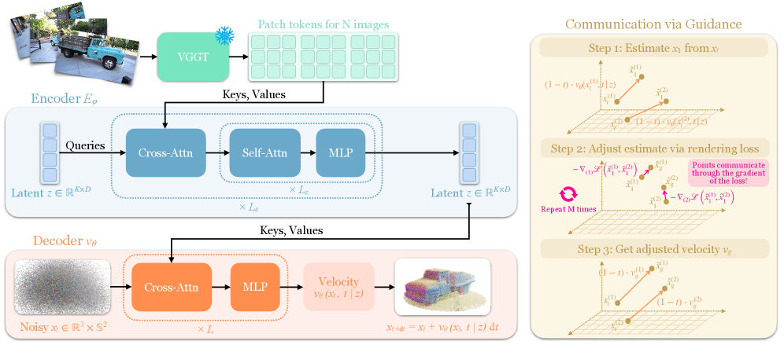

## Summary

Surflo 提出了一个前馈式 3D 表面重建方法：将任意数量（2~32 张）无位姿 RGB 图像压缩为一个固定大小的全局 latent（128×512），再通过流匹配（flow matching）将该 latent 解码为任意密度的定向点云（支持 10³~10⁶ 个点），最后通过 Delaunay 三角化得到网格。核心创新在于用 Perceiver 压缩器实现视图数量无关的全局编码、用独立逐点流匹配实现任意分辨率解码、以及用推理时的可微分渲染引导来保证逐点独立解码的一致性。在 8 个基准上匹配或超越现有前馈方法，比优化方法快一个数量级。

## 原始出处

- 原始文件: [surflo.md](../../raw/papers/surflo.md)
- 原文链接: [https://arxiv.org/abs/2606.13644](https://arxiv.org/abs/2606.13644)
- 项目页面: [https://anttwo.github.io/surflo](https://anttwo.github.io/surflo)

## Key Contributions

- **全局 latent 编码器**：基于冻结的 VGGT 骨干 + 3D 位置编码 + Perceiver 压缩器（K=128），将任意数量无位姿视图压缩为固定大小 latent $\mathbf{z} \in \mathbb{R}^{128 \times 512}$
- **流匹配解码器**：在 $\mathbb{R}^3 \times \mathbb{S}^2$ 上独立运输查询点，从噪声分布吹到表面，支持同一 latent 解码任意密度点云
- **渲染引导（guidance）**：ODE 积分末期（t≥0.95）通过可微分渲染梯度耦合独立点，消除漂浮点和不连续
- **Meshed DL3DV 数据集**：为 ~10.5K DL3DV 场景补充水密网格和定向点云，首个此规模的真实场景级水密表面数据集

## Method

**图 2：Surflo 三大组件。** 编码器（左）：冻结 VGGT 将 N 张无位姿 RGB 图映射为 patch tokens，Perceiver 压缩器用 K=128 可学习 queries 蒸馏为固定大小 latent $\mathbf{z} \in \mathbb{R}^{K \times D}$。解码器（中）：每个查询点 $\mathbf{x}_t \in \mathbb{R}^3 \times \mathbb{S}^2$ 经 cross-attention 与 $\mathbf{z}$ 交互，独立预测速度 $v_\theta$；任意数量点可并行积分。引导（右）：t≥0.95 时通过 M 步梯度下降优化全局渲染损失 $\mathcal{L}$，耦合逐点速度。

### 整体架构概览

Surflo 的设计围绕一个核心思想：多张图像编码的是同一个 3D 几何，所以中间表示应该是单一全局状态而非逐视图表示。整个 pipeline 分三步——

**编码阶段**：输入 N 张无位姿 RGB 图 → 经冻结 VGGT 提取特征 → 用 3D 位置编码标注每个 patch 的空间位置 → Perceiver 压缩器将全部 patch tokens 蒸馏为 K=128 个固定数量 latent tokens。无论输入 2 张还是 32 张图，latent 大小不变。

**解码阶段**：latent 不是直接解码为网格或体素，而是作为条件，用流匹配把噪声点一步步"吹"到表面。每个点独立处理，没有点间交互——这使得解码任意数量点（1K 到 1M）成为可能，全部共享同一个 latent。

**引导阶段**：由于逐点独立解码会导致漂浮点和表面不连续，推理末尾（t≥0.95）把当前预测的点实例化为 3D 高斯，通过可微分渲染比较与输入图像的差异，用梯度回传调整点位置，让点之间通过"从哪个角度看应该看到什么"这个全局信号来沟通。

### 编码器：从图像到固定大小的全局状态

**冻结 VGGT 骨干**：使用 VGGT-1B 作为特征提取器（冻结），从第 4、11、17、23 层提取 patch tokens，拼接后投影到工作维度 $D=512$。同时提取每张图的 camera tokens（4×D）。VGGT 还输出每张图的 pointmap（3D 坐标）和估计的相机参数。

**3D 位置编码**：从 VGGT pointmap 中读出每个 patch 中心的 3D 坐标 $\mathbf{p}_n \in \mathbb{R}^{N_p \times 3}$，用傅里叶特征 $\gamma(\mathbf{p}_n) \in \mathbb{R}^{N_p \times D}$ 编码后加到 patch tokens 上。这使得解码器查询某个 3D 位置时，能通过空间近邻性直接找到相关场景信息，不需要隐式学习坐标系映射。

**Perceiver 压缩**：K=128 个可学习 latent queries 通过 cross-attention 与所有 N×4N_p 个 patch tokens 交互，经 L_s=4 轮 self-attention 后得到最终 latent $\mathbf{z}_p \in \mathbb{R}^{128 \times 512}$。Camera tokens 经类似但更轻量的 Perceiver 压缩为 $\mathbf{z}_c \in \mathbb{R}^{1 \times 512}$，两者拼接为 $\mathbf{z} := [\mathbf{z}_p, \mathbf{z}_c]$。

### 流匹配解码器

**逐点流匹配**：每个查询点 $\mathbf{x} \in \mathbb{R}^3 \times \mathbb{S}^2$（位置+法线）从源分布 $p_0$ 到表面分布 $p_1$ 独立运输。训练时使用标准条件 OT 流匹配（Lipman et al., ICLR 2023）：

- 源点 $\mathbf{x}_0 \sim p_0$，目标 $\mathbf{x}_1 \sim p_1$（真实表面）
- 线性插值 $\mathbf{x}_t = (1-t)\mathbf{x}_0 + t\mathbf{x}_1$
- 网络预测速度 $v_\theta(\mathbf{x}_t, t | \mathbf{z})$，损失 $\mathcal{L}_{\text{FM}} = \mathbb{E}[ \|v_\theta - (\mathbf{x}_1 - \mathbf{x}_0)\|_2^2 ]$
- 时间采样 $t \sim \text{LogitNormal}(1, 1.6)$（在 t→1 附近赋予更高权重）

**解码器架构**：12 层 transformer，前 6 层带 cross-attention 到 latent $\mathbf{z}_p$。时间 $t$ 和 camera token $\mathbf{z}_c$ 通过 Ada-LN 嵌入调节。

**源分布设计**：法线均匀采样于 $\mathbb{S}^2$。3D 位置**不**从标准高斯采样，而是从以 VGGT 点云位置为中心的混合高斯分布采样（噪声标准差 $\sigma_s=0.1$，场景归一化坐标）。这使大部分起点靠近表面，模型不需要花容量处理空旷空间。

**法线表示**：查询点表示为 $\mathbf{x} = (\mathbf{m}, \mathbf{m}+\epsilon\mathbf{n}) \in \mathbb{R}^6$，其中 $\epsilon=10^{-3}$ 乘场景尺度。推理时取后三维与前三维之差并归一化得到法线。

### 引导机制（Communication via Guidance）

**动机**：逐点独立解码意味着每个点的损失函数只关心它自己是否落在表面上，不关心多个点是否落在**同一块**表面上。这导致漂浮点和表面不连续。

**方法**：在 ODE 积分的最后阶段（t≥0.95），使用 50+100 步双阶段时间网格。在每个 ODE 步中：

1. 从当前 $v_\theta$ 预测目标点 $\hat{\mathbf{x}}_1 = \mathbf{x}_t + (1-t)v_\theta$
2. 将所有 $\hat{\mathbf{x}}_1$ 实例化为 3D 高斯（带各向异性尺度、旋转、不透明度、球谐颜色），用 RaDe-GS 光栅化器渲染到输入视图
3. 计算渲染损失：$\mathcal{L}_{\text{render}} = \frac{1}{N}\sum_n [\lambda \|\hat{I}_n - I_n\|_1 + (1-\lambda)\text{DSSIM}(\hat{I}_n, I_n)]$，加上深度正则项
4. 运行 M=32 步梯度下降，梯度回传到点位置，得到引导后的目标 $\hat{\mathbf{x}}_1^g$
5. 用引导后的速度 $v_g = (\hat{\mathbf{x}}_1^g - \mathbf{x}_t)/(1-t)$ 执行欧拉步

**效果**：附近不一致的点收到相同的纠正信号，被拉回正确表面。渲染梯度也会回传到 VGGT 估计的相机位姿，修正微小位姿误差。

**可选单目深度引导**：使用 Depth Anything 3 的尺度不变深度排序损失，提供相对深度先验。

**漂浮点过滤**：引导过程中不透明度低的点被在线剪枝。

### 训练数据：Meshed DL3DV

对 ~10.5K DL3DV 场景每场景运行 Gaussian Wrapping 提取水密网格，从中均匀采样 $10^7$ 个定向点，经可见性检查过滤异常值后作为真实表面 $p_1$。训练时先采样 12 个场景，每场景取 N∈[2,16] 输入视图，在真实表面上均匀采样 ~8K 个点。

训练细节：AdamW，batch size 12 场景，每场景 8K 查询点，4×H100，400K 迭代。

## Training

- **损失函数**：标准流匹配 MSE 损失 $\mathcal{L}_{\text{FM}} = \mathbb{E}[ \|v_\theta(\mathbf{x}_t, t | \mathbf{z}) - (\mathbf{x}_1 - \mathbf{x}_0)\|_2^2 ]$
- **坐标对齐**：将 COLMAP 坐标系下的真实点通过仿射变换映射到 VGGT 坐标系（两阶段：初始相似变换 + 加权最小二乘精调），再计算损失
- **优化器**：AdamW，batch size 12 场景，8K 点/场景/step
- **硬件**：4×H100，400K 迭代
- **学习率**：未在正文明确给出（需参考 appendix）
- **VGGT 特征缓存**：每个场景每套视图集的 VGGT tokens 缓存一次，避免每 epoch 重复计算
- **CFG**：以 0.1 概率将 VGGT 特征掩码为零，支持推理时无分类器引导

## Results & Comparisons

| 方法 | 输入类型 | F1↑（平均） | CD↓（平均） |
|------|---------|-----------|-----------|
| Surflo (无引导) | 16 张无位姿 | — | — |
| Surflo (光度引导) | 16 张无位姿 | **最高** | **最低** |
| Surflo (光度+深度引导) | 16 张无位姿 | **最高** | **最低** |
| VGGT + TSDF | 16 张无位姿 | 显著更低 | 显著更高 |
| DA-3 + TSDF | 16 张无位姿 | 显著更低 | 显著更高 |
| NOVA3R | 2 张 | 受限于固定 10K 点 | — |
| 2DGS | 16 张 + VGGT 初始化 | — | — |
| RaDe-GS | 16 张 + VGGT 初始化 | — | — |
| GW | 16 张 + VGGT 初始化 | — | — |

- Surflo 在 8 个基准上匹配或超越所有对比方法（每个基准的具体数值见论文 Table 1）
- 与优化方法（2DGS/RaDe-GS/GW）比：Surflo 在稀疏视图（16 张）下显著更优，速度快一个数量级
- 与 VGGT 点云比：TSDF 融合多视图重叠点云依然无法得到干净表面
- 与 NOVA3R 比：NOVA3R 只训 2 视图且输出固定 10K 点，更多视图或更高密度都不支持
- **可扩展解码**：同一 latent 支持 8K 点快速预览、100K 点细节、1M 点高精网格，全在同一个前向传播中

## Related Work Analysis

- **VGGT 系列**（冻结骨干的基础）：VGGT 预测逐视图 pointmap，随视图线性增长且不直接对齐；Surflo 用 Perceiver 压缩为一个全局 latent，解除了与视图数的依赖
- **NOVA3R**：同样用全局 latent，但只支持 2 视图输入且固定输出 10K 点；Surflo 通过流匹配实现任意密度解码
- **Gaussian Wrapping**：优化方法，需密集视图和长时间优化；Surflo 在 16 张稀疏视图下就用前馈推理超越它
- **D4RT**：也查询独立点，但基于密集视频且回归像素锚定查询，不生成自由定向点
- **Rectified Flow**：Surflo 使用标准条件 OT 流匹配而非 rectified flow

## Ablations

关键消融实验（详见论文）：

1. **引导机制消融**：无引导 → 漂浮点 + 细节缺失；光度引导 → 大幅改善细节和一致性；加单目深度引导 → 进一步锐化几何
2. **源分布设计**：标准高斯 vs VGGT 附近加噪 → 后者收敛更快，质量更高
3. **3D 位置编码**：去掉傅里叶编码 → 性能显著下降，验证了空间对齐的重要性
4. **Perceiver 压缩器**：改变 latent 数量 K 的影响
5. **流匹配 vs 扩散**：（推测）流匹配的直线轨迹比扩散的噪声预测更适合逐点解码

## Limitations

- 每个点独立处理，引导阶段虽能缓解漂浮点但增加了推理计算量
- VGGT 的位姿估计能力限制了 Surflo：VGGT 失败（如极端的视角变化或无纹理区域）时，Surflo 也受影响
- 目前只处理几何（位置+法线），不输出材质/BDRF 信息
- 引导阶段需要可微分渲染器，对显存有较高需求
- 数据集只覆盖 DL3DV 风格场景，泛化到极端场景（如镜面、大量透明物体）需验证

## 评论与启示

- 本文最优雅的设计是"3D 位置编码 + Perceiver 压缩"的组合：傅里叶编码使 decoder 通过空间近邻性直接找到相关场景信息，Perceiver 将任意数量 patch tokens 压缩为固定大小 latent。这比让网络隐式学习坐标系映射要干净得多
- 流匹配的选择比扩散更自然——流匹配预测位移向量 $x_1 - x_0$，对逐点运输任务来说，速度就是"往表面哪个方向移动多少"，直觉上比预测噪声更直接
- 源分布设计（VGGT 点云附近加噪）很务实：VGGT 已经给了一个不错的粗略几何，模型只需要做精调。这和扩散模型中的"从噪声分布采样，模型负责从无到有"是哲学上的不同——后者浪费 capacity 在空旷空间
- 引导阶段本质上是"用渲染一致性来替代点间交互"，是和逐点独立解码的 trade-off：独立解码带来了任意密度的灵活性，但代价是需要额外的引导步来保证一致性。如果 decoder 本身能集成某种形式的点间注意力（但那样就无法支持任意密度），可能不需要引导
- 数据和代码未开源（论文称将在发表时释出），Meshed DL3DV 数据集会成为场景级表面学习的重要资源
- 与 [[Rectified Flow|rectified-flow]] 同属流匹配家族，但应用领域完全不同（这里是 3D 几何而非生成模型）

## Connections

- [[Rectified Flow|rectified-flow]] — 同为流匹配框架，Surflo 使用标准条件 OT 流匹配（而非 rectified flow）
- [[Volumetric Surfaces|volumetric-surfaces]] — 两者都从多视图做表面重建，但 Volumetric Surfaces 用可微渲染优化，Surflo 是前馈式
- [[Proxy-GS|proxy-gs]] — 用网格加速 3DGS，Surflo 用 3DGS 作引导
- [[Ref-DGS|ref-dgs]] / [[GS-2M|gs-2m]] — 同属表面重建方向，但 Ref-DGS 和 GS-2M 侧重镜面/材质感知重建，Surflo 侧重前馈式通用几何

## Contradictions

- 与 VGGT "多视图应该产生重叠 pointmaps" 的哲学相反，Surflo 认为多视图应该压缩为单一全局状态
- 与 NOVA3R "全局 latent 只能解码固定分辨率" 的隐含假设相反，Surflo 证明了同一 latent 可以解码任意密度
